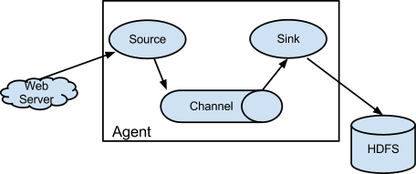

.. Licensed to the Apache Software Foundation (ASF) under one or more
   contributor license agreements.  See the NOTICE file distributed with
   this work for additional information regarding copyright ownership.
   The ASF licenses this file to You under the Apache License, Version 2.0
   (the "License"); you may not use this file except in compliance with
   the License.  You may obtain a copy of the License at

       http://www.apache.org/licenses/LICENSE-2.0

   Unless required by applicable law or agreed to in writing, software
   distributed under the License is distributed on an "AS IS" BASIS,
   WITHOUT WARRANTIES OR CONDITIONS OF ANY KIND, either express or implied.
   See the License for the specific language governing permissions and
   limitations under the License.

==========================================
Flume 1.3.0 Developer Guide
==========================================

Introduction
============

Overview
--------

Apache Flume is a distributed, reliable, and available system for
efficiently collecting, aggregating and moving large amounts of log
data from many different sources to a centralized data store.

Apache Flume is a top level project at the Apache Software Foundation.
There are currently two release code lines available, versions 0.9.x and 1.x.
This documentation applies to the 1.x codeline.
Please click here for
`the Flume 0.9.x Developer Guide <http://archive.cloudera.com/cdh/3/flume/DeveloperGuide/>`_.

Architecture
------------

Data flow model
~~~~~~~~~~~~~~~

A unit of data flow is called event which is a byte payload that is accompanied
by an optional set of string attributes. Flume agent is a process (JVM) that
hosts the components that flows events from an external source to next
destination.

A source consumes events delivered to it by an external source like web server
in a specific format. For example, an Avro source can be used to receive Avro
events from clients or other agents in the flow. When a source receives an
event, it stores it into one or more channels.  The channel is a passive store
that keeps the event until its consumed by a sink.  An example of channel is
the JDBC channel that uses a file-system backed embedded database. The sink
removes the event from channel and puts it into an external repository like
HDFS or forwards it to the source in next hop of the flow. The source and sink
within the given agent run asynchronously with the events staged in the
channel.

Reliability
~~~~~~~~~~~

The events are staged in the channel on each agent. Then they are delivered to
the next agent or terminal repository (like HDFS) in the flow. The events are
removed from the channel only after they are stored in the channel of next
agent or in the terminal repository. This is a how the single-hop message
delivery semantics in Flume provide end-to-end reliability of the flowFlume
uses transactional approach to guarantee the reliable delivery of the events.
The sources and sinks encapsulate the store/retrieval of the events in a
transaction provided by the channel. This ensures that the set of events are
reliably passed from point to point in the flow. In case of multi hop flow, the
sink on previous hop and source on next hop both have their transactions
running to ensure that the data is safely stored in the channel of the next
hop.

Building Flume
--------------

Getting the source
~~~~~~~~~~~~~~~~~~

Check out the code using Subversion. Click here for
`the git repository root <https://git-wip-us.apache.org/repos/asf/flume.git>`_.

The Flume 1.x development happens under the branch "trunk" so this command line
can be used::

  git clone https://git-wip-us.apache.org/repos/asf/flume.git flume-trunk

Compile/test Flume
~~~~~~~~~~~~~~~~~~

The Flume build is mavenized. You can compile Flume using the standard Maven
commands:

#. Compile only: ``mvn clean compile``
#. Compile and run unit tests: ``mvn clean test``
#. Run individual test(s): ``mvn clean test -Dtest=<Test1>,<Test2>,... -DfailIfNoTests=false``
#. Create tarball package: ``mvn clean install``
#. Create tarball package (skip unit tests): ``mvn clean install -DskipTests``

(Please note that Flume requires that Google Protocol Buffers compiler be in the path
for the build to be successful. You download and install it by following
the instructions `here <https://developers.google.com/protocol-buffers/>`_.)

Developing custom components
----------------------------

Client
~~~~~~

The client operates at the point of origin of events and delivers them to a
Flume agent. Clients typically operate in the process space of the application
they are consuming data from. Currently flume supports Avro, log4j and syslog
as ways to transfer data from remote source. Additionally there’s an Exec
source that can consume the output of a local process as input to Flume.

It’s quite possible to have a use case where these existing options are not
sufficient. In this case you can build a custom mechanism to send data to
Flume. There are two ways of achieving this. First is to create a custom client
that communicates to one of the flume’s existing sources like Avro or syslog.
Here the client should convert it’s data into messages understood by these
Flume sources. The other option is to write a custom Flume source that directly
talks to your existing client application using some IPC or RPC protocols, and
then convert the data into flume events to send it upstream.

Client SDK
''''''''''

Though flume contains a number of built in mechanisms to ingest data, often one
wants the ability to communicate with flume directly from a custom application.
The Client SDK is a library that enables applications to connect to Flume and
send data into Flume’s data flow over RPC.

RPC Client interface
''''''''''''''''''''

The is an interface to wrap the user data data and attributes into an
``Event``, which is Flume’s unit of flow. This encapsulates the RPC mechanism
supported by Flume. The application can simply call ``append()`` or
``appendBatch()`` to send data and not worry about the underlying message
exchanges.

Avro RPC Client
'''''''''''''''

As of Flume 1.1.0, Avro is the only support RPC protocol.  The
``NettyAvroRpcClient`` implements the ``RpcClient`` interface. The client needs
to create this object with the host and port of the Flume agent and use it to
send data into flume. The following example shows how to use the Client SDK
API:

.. code-block:: java

  import org.apache.flume.Event;
  import org.apache.flume.EventDeliveryException;
  import org.apache.flume.FlumeException;
  import org.apache.flume.api.RpcClient;
  import org.apache.flume.api.RpcClientFactory;
  import org.apache.flume.event.EventBuilder;

  public void myInit () {
    // setup the RPC connection to Flume agent at hostname/port
    RpcClient rpcClient = RpcClientFactory.getDefaultInstance(hostname, port);
    ...
  }

  public void sendDataToFlume(String data) {
    // Create flume event object
    Event event = EventBuilder.withBody(data, Charset.forName("UTF-8"));
    try {
        rpcClient.append(event);
    } catch (EventDeliveryException e) {
        // clean up and recreate rpcClient
        rpcClient.close();
        rpcClient = null;
        rpcClient = RpcClientFactory.getDefaultInstance(hostname, port);
    }
    ...
  }

  public void cleanUp () {
    // close the rpc connection
    rpcClient.close();
    ...
  }

Failover handler
''''''''''''''''

This class wraps the Avro RPC client to provide failover handling capability to
clients. This takes a list of host/ports of the Flume agent. If there’s an
error in communicating the current agent, then it automatically falls back to
the next agent in the list:

.. code-block:: java

  // Setup properties for the failover
  Properties props = new Properties();
  props.put("client.type", "default_failover");

  // list of hosts
  props.put("hosts", "host1 host2 host3");

  // address/port pair for each host
  props.put("hosts.host1", host1 + ":" + port1);
  props.put("hosts.host1", host2 + ":" + port2);
  props.put("hosts.host1", host3 + ":" + port3);

  // create the client with failover properties
  client = (FailoverRpcClient);
  RpcClientFactory.getInstance(props);

Transaction interface
~~~~~~~~~~~~~~~~~~~~~

The ``Transaction`` interface is the basis of reliability for Flume. All the
major components ie. sources, sinks and channels needs to interface with Flume
transaction.

.. figure:: images/DevGuide_image01.png
   :align: center
   :alt: Transaction sequence diagram

The transaction interface is implemented by a channel implementation. The
source and sink connected to channel obtain a transaction object. The sources
actually use a channel selector interface that encapsulate the transaction
(discussed in later sections). The operations to stage or extract an event is
done inside an active transaction. For example:

.. code-block:: java

  Channel ch = ...
  Transaction tx = ch.getTransaction();
  try {
    tx.begin();
    ...
      // ch.put(event) or ch.take()
      ...
      tx.commit();
  } catch (ChannelException ex) {
    tx.rollback();
    ...
  } finally {
    tx.close();
  }

Here we get hold of a transaction from a channel. After the begin method is
executed, the event is put in the channel and transaction is committed.

Sink
~~~~

The purpose of a sink to extract events from the channel and forward it to the
next Agent in the flow or store in an external repository. A sink is linked to
a channel instance as per the flow configuration. There’s a sink runner thread
that’s get created for every configured sink which manages the sink’s
lifecycle. The sink needs to implement ``start()`` and ``stop()`` methods that
are part of the ``LifecycleAware`` interface. The ``start()`` method should
initialize the sink and bring it to a state where it can forward the events to
its next destination.  The ``process()`` method from the ``Sink`` interface
should do the core processing of extracting the event from channel and
forwarding it. The ``stop()`` method should do the necessary cleanup. The sink
also needs to implement a ``Configurable`` interface for processing its own
configuration settings:

.. code-block:: java

  // foo sink
  public class FooSink extends AbstractSink implements Configurable {
    @Override
    public void configure(Context context) {
      some_Param = context.get("some_param", String.class);
      // process some_param …
    }
    @Override
    public void start() {
      // initialize the connection to foo repository ..
    }
    @Override
    public void stop () {
      // cleanup and disconnect from foo repository ..
    }
    @Override
    public Status process() throws EventDeliveryException {
      // Start transaction
      ch = getChannel();
      tx = ch.getTransaction();
      try {
        tx.begin();
        Event e = ch.take();
        // send the event to foo
        // foo.some_operation(e);
        tx.commit();
        sgtatus = Status.READY;
        (ChannelException e) {
          tx.rollback();
          status = Status.BACKOFF;
        } finally {
          tx.close();
        }
        return status;
      }
    }
  }

Source
~~~~~~

The purpose of a Source is to receive data from an external client and store it
in the channel. As mentioned above, for sources the ``Transaction`` interface
is encapsulated by the ``ChannelSelector``. Similar to ``SinkRunner``, there’s
a ``SourceRunner`` thread that gets created for every configured source that
manages the source’s lifecycle. The source needs to implement ``start()`` and
``stop()`` methods that are part of the ``LifecycleAware`` interface. There are
two types of sources, pollable and event-driven. The runner of pollable source
runner invokes a ``process()`` method from the pollable source. The
``process()`` method should check for new data and store it in the channel. The
event driven source needs have its own callback mechanism that captures the new
data:

.. code-block:: java

  // bar source
  public class BarSource extends AbstractSource implements Configurable, PollableSource {
    @Override
    public void configure(Context context) {
      some_Param = context.get("some_param", String.class);
      // process some_param …
    }
    @Override
    public void start() {
      // initialize the connection to bar client ..
    }
    @Override
    public void stop () {
      // cleanup and disconnect from bar client ..
    }
    @Override
    public Status process() throws EventDeliveryException {
      try {
        // receive new data
        Event e = get_some_data();
        // store the event to underlying channels(s)
        getChannelProcessor().processEvent(e)
      } catch (ChannelException ex) {
        return Status.BACKOFF;
      }
      return Status.READY;
    }
  }

Channel
~~~~~~~

TBD
