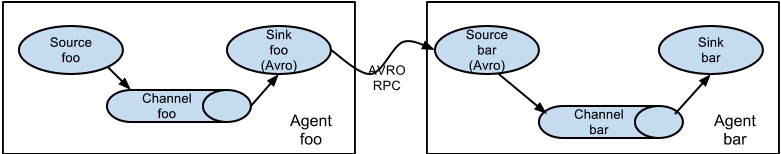

.. Licensed to the Apache Software Foundation (ASF) under one or more
   contributor license agreements.  See the NOTICE file distributed with
   this work for additional information regarding copyright ownership.
   The ASF licenses this file to You under the Apache License, Version 2.0
   (the "License"); you may not use this file except in compliance with
   the License.  You may obtain a copy of the License at

       http://www.apache.org/licenses/LICENSE-2.0

   Unless required by applicable law or agreed to in writing, software
   distributed under the License is distributed on an "AS IS" BASIS,
   WITHOUT WARRANTIES OR CONDITIONS OF ANY KIND, either express or implied.
   See the License for the specific language governing permissions and
   limitations under the License.

======================================
Flume 1.6.0 User Guide
======================================

Introduction
============

Overview
--------

Apache Flume is a distributed, reliable, and available system for efficiently
collecting, aggregating and moving large amounts of log data from many
different sources to a centralized data store.

The use of Apache Flume is not only restricted to log data aggregation. 
Since data sources are customizable, Flume can be used to transport massive quantities
of event data including but not limited to network traffic data, social-media-generated data, 
email messages and pretty much any data source possible.

Apache Flume is a top level project at the Apache Software Foundation.

There are currently two release code lines available, versions 0.9.x and 1.x.

Documentation for the 0.9.x track is available at 
`the Flume 0.9.x User Guide <http://archive.cloudera.com/cdh/3/flume/UserGuide/>`_.

This documentation applies to the 1.4.x track.

New and existing users are encouraged to use the 1.x releases so as to 
leverage the performance improvements and configuration flexibilities available 
in the latest architecture.

System Requirements
-------------------

#. Java Runtime Environment - Java 1.6 or later (Java 1.7 Recommended)
#. Memory - Sufficient memory for configurations used by sources, channels or sinks
#. Disk Space - Sufficient disk space for configurations used by channels or sinks
#. Directory Permissions - Read/Write permissions for directories used by agent

Architecture
------------

Data flow model
~~~~~~~~~~~~~~~

A Flume event is defined as a unit of data flow having a byte payload and an
optional set of string attributes. A Flume agent is a (JVM) process that hosts
the components through which events flow from an external source to the next
destination (hop).

.. figure:: images/UserGuide_image00.png
   :align: center
   :alt: Agent component diagram

A Flume source consumes events delivered to it by an external source like a web
server. The external source sends events to Flume in a format that is
recognized by the target Flume source. For example, an Avro Flume source can be
used to receive Avro events from Avro clients or other Flume agents in the flow
that send events from an Avro sink. A similar flow can be defined using
a Thrift Flume Source to receive events from a Thrift Sink or a Flume
Thrift Rpc Client or Thrift clients written in any language generated from
the Flume thrift protocol.When a Flume source receives an event, it
stores it into one or more channels. The channel is a passive store that keeps
the event until it's consumed by a Flume sink. The file channel is one example
-- it is backed by the local filesystem. The sink removes the event
from the channel and puts it into an external repository like HDFS (via Flume
HDFS sink) or forwards it to the Flume source of the next Flume agent (next
hop) in the flow. The source and sink within the given agent run asynchronously
with the events staged in the channel.

Complex flows
~~~~~~~~~~~~~

Flume allows a user to build multi-hop flows where events travel through
multiple agents before reaching the final destination. It also allows fan-in
and fan-out flows, contextual routing and backup routes (fail-over) for failed
hops.

Reliability
~~~~~~~~~~~

The events are staged in a channel on each agent. The events are then delivered
to the next agent or terminal repository (like HDFS) in the flow. The events
are removed from a channel only after they are stored in the channel of next
agent or in the terminal repository. This is a how the single-hop message
delivery semantics in Flume provide end-to-end reliability of the flow.

Flume uses a transactional approach to guarantee the reliable delivery of the
events. The sources and sinks encapsulate in a transaction the
storage/retrieval, respectively, of the events placed in or provided by a
transaction provided by the channel.  This ensures that the set of events are
reliably passed from point to point in the flow. In the case of a multi-hop
flow, the sink from the previous hop and the source from the next hop both have
their transactions running to ensure that the data is safely stored in the
channel of the next hop.

Recoverability
~~~~~~~~~~~~~~

The events are staged in the channel, which manages recovery from failure.
Flume supports a durable file channel which is backed by the local file system.
There's also a memory channel which simply stores the events in an in-memory
queue, which is faster but any events still left in the memory channel when an
agent process dies can't be recovered.

Setup
=====

Setting up an agent
-------------------

Flume agent configuration is stored in a local configuration file.  This is a
text file that follows the Java properties file format.
Configurations for one or more agents can be specified in the same
configuration file. The configuration file includes properties of each source,
sink and channel in an agent and how they are wired together to form data
flows.

Configuring individual components
~~~~~~~~~~~~~~~~~~~~~~~~~~~~~~~~~

Each component (source, sink or channel) in the flow has a name, type, and set
of properties that are specific to the type and instantiation. For example, an
Avro source needs a hostname (or IP address) and a port number to receive data
from. A memory channel can have max queue size ("capacity"), and an HDFS sink
needs to know the file system URI, path to create files, frequency of file
rotation ("hdfs.rollInterval") etc. All such attributes of a component needs to
be set in the properties file of the hosting Flume agent.

Wiring the pieces together
~~~~~~~~~~~~~~~~~~~~~~~~~~

The agent needs to know what individual components to load and how they are
connected in order to constitute the flow. This is done by listing the names of
each of the sources, sinks and channels in the agent, and then specifying the
connecting channel for each sink and source. For example, an agent flows events
from an Avro source called avroWeb to HDFS sink hdfs-cluster1 via a file
channel called file-channel. The configuration file will contain names of these
components and file-channel as a shared channel for both avroWeb source and
hdfs-cluster1 sink.

Starting an agent
~~~~~~~~~~~~~~~~~

An agent is started using a shell script called flume-ng which is located in
the bin directory of the Flume distribution. You need to specify the agent
name, the config directory, and the config file on the command line::

  $ bin/flume-ng agent -n $agent_name -c conf -f conf/flume-conf.properties.template

Now the agent will start running source and sinks configured in the given
properties file.

A simple example
~~~~~~~~~~~~~~~~
Here, we give an example configuration file, describing a single-node Flume deployment.
This configuration lets a user generate events and subsequently logs them to the console.

.. code-block:: properties

  # example.conf: A single-node Flume configuration

  # Name the components on this agent
  a1.sources = r1
  a1.sinks = k1
  a1.channels = c1

  # Describe/configure the source
  a1.sources.r1.type = netcat
  a1.sources.r1.bind = localhost
  a1.sources.r1.port = 44444

  # Describe the sink
  a1.sinks.k1.type = logger

  # Use a channel which buffers events in memory
  a1.channels.c1.type = memory
  a1.channels.c1.capacity = 1000
  a1.channels.c1.transactionCapacity = 100

  # Bind the source and sink to the channel
  a1.sources.r1.channels = c1
  a1.sinks.k1.channel = c1

This configuration defines a single agent named a1. a1 has a source that listens for data on port 44444, a channel
that buffers event data in memory, and a sink that logs event data to the console. The configuration file names the
various components, then describes their types and configuration parameters. A given configuration file might define
several named agents; when a given Flume process is launched a flag is passed telling it which named agent to manifest.

Given this configuration file, we can start Flume as follows::

  $ bin/flume-ng agent --conf conf --conf-file example.conf --name a1 -Dflume.root.logger=INFO,console

Note that in a full deployment we would typically include one more option: ``--conf=<conf-dir>``.
The ``<conf-dir>`` directory would include a shell script *flume-env.sh* and potentially a log4j properties file.
In this example, we pass a Java option to force Flume to log to the console and we go without a custom environment script.

From a separate terminal, we can then telnet port 44444 and send Flume an event:

.. code-block:: properties

  $ telnet localhost 44444
  Trying 127.0.0.1...
  Connected to localhost.localdomain (127.0.0.1).
  Escape character is '^]'.
  Hello world! <ENTER>
  OK

The original Flume terminal will output the event in a log message.

.. code-block:: properties

  12/06/19 15:32:19 INFO source.NetcatSource: Source starting
  12/06/19 15:32:19 INFO source.NetcatSource: Created serverSocket:sun.nio.ch.ServerSocketChannelImpl[/127.0.0.1:44444]
  12/06/19 15:32:34 INFO sink.LoggerSink: Event: { headers:{} body: 48 65 6C 6C 6F 20 77 6F 72 6C 64 21 0D          Hello world!. }

Congratulations - you've successfully configured and deployed a Flume agent! Subsequent sections cover agent configuration in much more detail.

Zookeeper based Configuration
~~~~~~~~~~~~~~~~~~~~~~~~~~~~~

Flume supports Agent configurations via Zookeeper. *This is an experimental feature.* The configuration file needs to be uploaded
in the Zookeeper, under a configurable prefix. The configuration file is stored in Zookeeper Node data.
Following is how the Zookeeper Node tree would look like for agents a1 and a2

.. code-block:: properties

  - /flume
   |- /a1 [Agent config file]
   |- /a2 [Agent config file]

Once the configuration file is uploaded, start the agent with following options

  $ bin/flume-ng agent --conf conf -z zkhost:2181,zkhost1:2181 -p /flume --name a1 -Dflume.root.logger=INFO,console

==================   ================  =========================================================================
Argument Name        Default           Description
==================   ================  =========================================================================
**z**                --                Zookeeper connection string. Comma separated list of hostname:port
**p**                /flume            Base Path in Zookeeper to store Agent configurations
==================   ================  =========================================================================

Installing third-party plugins
~~~~~~~~~~~~~~~~~~~~~~~~~~~~~~

Flume has a fully plugin-based architecture. While Flume ships with many
out-of-the-box sources, channels, sinks, serializers, and the like, many
implementations exist which ship separately from Flume.

While it has always been possible to include custom Flume components by
adding their jars to the FLUME_CLASSPATH variable in the flume-env.sh file,
Flume now supports a special directory called ``plugins.d`` which automatically
picks up plugins that are packaged in a specific format. This allows for easier
management of plugin packaging issues as well as simpler debugging and
troubleshooting of several classes of issues, especially library dependency
conflicts.

The plugins.d directory
'''''''''''''''''''''''

The ``plugins.d`` directory is located at ``$FLUME_HOME/plugins.d``. At startup
time, the ``flume-ng`` start script looks in the ``plugins.d`` directory for
plugins that conform to the below format and includes them in proper paths when
starting up ``java``.

Directory layout for plugins
''''''''''''''''''''''''''''

Each plugin (subdirectory) within ``plugins.d`` can have up to three
sub-directories:

#. lib - the plugin's jar(s)
#. libext - the plugin's dependency jar(s)
#. native - any required native libraries, such as ``.so`` files

Example of two plugins within the plugins.d directory:

.. code-block:: none

  plugins.d/
  plugins.d/custom-source-1/
  plugins.d/custom-source-1/lib/my-source.jar
  plugins.d/custom-source-1/libext/spring-core-2.5.6.jar
  plugins.d/custom-source-2/
  plugins.d/custom-source-2/lib/custom.jar
  plugins.d/custom-source-2/native/gettext.so

Data ingestion
--------------

Flume supports a number of mechanisms to ingest data from external sources.

RPC
~~~

An Avro client included in the Flume distribution can send a given file to
Flume Avro source using avro RPC mechanism::

  $ bin/flume-ng avro-client -H localhost -p 41414 -F /usr/logs/log.10

The above command will send the contents of /usr/logs/log.10 to to the Flume
source listening on that ports.

Executing commands
~~~~~~~~~~~~~~~~~~

There's an exec source that executes a given command and consumes the output. A
single 'line' of output ie. text followed by carriage return ('\\r') or line
feed ('\\n') or both together.

.. note:: Flume does not support tail as a source. One can wrap the tail command in an exec source to stream the file.

Network streams
~~~~~~~~~~~~~~~

Flume supports the following mechanisms to read data from popular log stream
types, such as:

#. Avro
#. Thrift
#. Syslog
#. Netcat

Setting multi-agent flow
------------------------

In order to flow the data across multiple agents or hops, the sink of the
previous agent and source of the current hop need to be avro type with the sink
pointing to the hostname (or IP address) and port of the source.

Consolidation
-------------

A very common scenario in log collection is a large number of log producing
clients sending data to a few consumer agents that are attached to the storage
subsystem. For example, logs collected from hundreds of web servers sent to a
dozen of agents that write to HDFS cluster.

.. figure:: images/UserGuide_image02.png
   :align: center
   :alt: A fan-in flow using Avro RPC to consolidate events in one place

This can be achieved in Flume by configuring a number of first tier agents with
an avro sink, all pointing to an avro source of single agent (Again you could
use the thrift sources/sinks/clients in such a scenario). This source
on the second tier agent consolidates the received events into a single
channel which is consumed by a sink to its final destination.

Multiplexing the flow
---------------------

Flume supports multiplexing the event flow to one or more destinations. This is
achieved by defining a flow multiplexer that can replicate or selectively route
an event to one or more channels.

.. figure:: images/UserGuide_image01.png
   :align: center
   :alt: A fan-out flow using a (multiplexing) channel selector

The above example shows a source from agent "foo" fanning out the flow to three
different channels. This fan out can be replicating or multiplexing. In case of
replicating flow, each event is sent to all three channels. For the
multiplexing case, an event is delivered to a subset of available channels when
an event's attribute matches a preconfigured value. For example, if an event
attribute called "txnType" is set to "customer", then it should go to channel1
and channel3, if it's "vendor" then it should go to channel2, otherwise
channel3. The mapping can be set in the agent's configuration file.

Configuration
=============

As mentioned in the earlier section, Flume agent configuration is read from a
file that resembles a Java property file format with hierarchical property
settings.

Defining the flow
-----------------

To define the flow within a single agent, you need to link the sources and
sinks via a channel. You need to list the sources, sinks and channels for the
given agent, and then point the source and sink to a channel. A source instance
can specify multiple channels, but a sink instance can only specify one channel.
The format is as follows:

.. code-block:: properties

  # list the sources, sinks and channels for the agent
  <Agent>.sources = <Source>
  <Agent>.sinks = <Sink>
  <Agent>.channels = <Channel1> <Channel2>

  # set channel for source
  <Agent>.sources.<Source>.channels = <Channel1> <Channel2> ...

  # set channel for sink
  <Agent>.sinks.<Sink>.channel = <Channel1>

For example, an agent named agent_foo is reading data from an external avro client and sending
it to HDFS via a memory channel. The config file weblog.config could look like:

.. code-block:: properties

  # list the sources, sinks and channels for the agent
  agent_foo.sources = avro-appserver-src-1
  agent_foo.sinks = hdfs-sink-1
  agent_foo.channels = mem-channel-1

  # set channel for source
  agent_foo.sources.avro-appserver-src-1.channels = mem-channel-1

  # set channel for sink
  agent_foo.sinks.hdfs-sink-1.channel = mem-channel-1

This will make the events flow from avro-AppSrv-source to hdfs-Cluster1-sink
through the memory channel mem-channel-1. When the agent is started with the
weblog.config as its config file, it will instantiate that flow.

Configuring individual components
---------------------------------

After defining the flow, you need to set properties of each source, sink and
channel. This is done in the same hierarchical namespace fashion where you set
the component type and other values for the properties specific to each
component:

.. code-block:: properties

  # properties for sources
  <Agent>.sources.<Source>.<someProperty> = <someValue>

  # properties for channels
  <Agent>.channel.<Channel>.<someProperty> = <someValue>

  # properties for sinks
  <Agent>.sources.<Sink>.<someProperty> = <someValue>

The property "type" needs to be set for each component for Flume to understand
what kind of object it needs to be. Each source, sink and channel type has its
own set of properties required for it to function as intended. All those need
to be set as needed. In the previous example, we have a flow from
avro-AppSrv-source to hdfs-Cluster1-sink through the memory channel
mem-channel-1. Here's an example that shows configuration of each of those
components:

.. code-block:: properties

  agent_foo.sources = avro-AppSrv-source
  agent_foo.sinks = hdfs-Cluster1-sink
  agent_foo.channels = mem-channel-1

  # set channel for sources, sinks

  # properties of avro-AppSrv-source
  agent_foo.sources.avro-AppSrv-source.type = avro
  agent_foo.sources.avro-AppSrv-source.bind = localhost
  agent_foo.sources.avro-AppSrv-source.port = 10000

  # properties of mem-channel-1
  agent_foo.channels.mem-channel-1.type = memory
  agent_foo.channels.mem-channel-1.capacity = 1000
  agent_foo.channels.mem-channel-1.transactionCapacity = 100

  # properties of hdfs-Cluster1-sink
  agent_foo.sinks.hdfs-Cluster1-sink.type = hdfs
  agent_foo.sinks.hdfs-Cluster1-sink.hdfs.path = hdfs://namenode/flume/webdata

  #...

Adding multiple flows in an agent
---------------------------------

A single Flume agent can contain several independent flows. You can list
multiple sources, sinks and channels in a config. These components can be
linked to form multiple flows:

.. code-block:: properties

  # list the sources, sinks and channels for the agent
  <Agent>.sources = <Source1> <Source2>
  <Agent>.sinks = <Sink1> <Sink2>
  <Agent>.channels = <Channel1> <Channel2>

Then you can link the sources and sinks to their corresponding channels (for
sources) of channel (for sinks) to setup two different flows. For example, if
you need to setup two flows in an agent, one going from an external avro client
to external HDFS and another from output of a tail to avro sink, then here's a
config to do that:

.. code-block:: properties

  # list the sources, sinks and channels in the agent
  agent_foo.sources = avro-AppSrv-source1 exec-tail-source2
  agent_foo.sinks = hdfs-Cluster1-sink1 avro-forward-sink2
  agent_foo.channels = mem-channel-1 file-channel-2

  # flow #1 configuration
  agent_foo.sources.avro-AppSrv-source1.channels = mem-channel-1
  agent_foo.sinks.hdfs-Cluster1-sink1.channel = mem-channel-1

  # flow #2 configuration
  agent_foo.sources.exec-tail-source2.channels = file-channel-2
  agent_foo.sinks.avro-forward-sink2.channel = file-channel-2

Configuring a multi agent flow
------------------------------

To setup a multi-tier flow, you need to have an avro/thrift sink of first hop
pointing to avro/thrift source of the next hop. This will result in the first
Flume agent forwarding events to the next Flume agent. For example, if you are
periodically sending files (1 file per event) using avro client to a local
Flume agent, then this local agent can forward it to another agent that has the
mounted for storage.

Weblog agent config:

.. code-block:: properties

  # list sources, sinks and channels in the agent
  agent_foo.sources = avro-AppSrv-source
  agent_foo.sinks = avro-forward-sink
  agent_foo.channels = file-channel

  # define the flow
  agent_foo.sources.avro-AppSrv-source.channels = file-channel
  agent_foo.sinks.avro-forward-sink.channel = file-channel

  # avro sink properties
  agent_foo.sources.avro-forward-sink.type = avro
  agent_foo.sources.avro-forward-sink.hostname = 10.1.1.100
  agent_foo.sources.avro-forward-sink.port = 10000

  # configure other pieces
  #...

HDFS agent config:

.. code-block:: properties

  # list sources, sinks and channels in the agent
  agent_foo.sources = avro-collection-source
  agent_foo.sinks = hdfs-sink
  agent_foo.channels = mem-channel

  # define the flow
  agent_foo.sources.avro-collection-source.channels = mem-channel
  agent_foo.sinks.hdfs-sink.channel = mem-channel

  # avro sink properties
  agent_foo.sources.avro-collection-source.type = avro
  agent_foo.sources.avro-collection-source.bind = 10.1.1.100
  agent_foo.sources.avro-collection-source.port = 10000

  # configure other pieces
  #...

Here we link the avro-forward-sink from the weblog agent to the
avro-collection-source of the hdfs agent. This will result in the events coming
from the external appserver source eventually getting stored in HDFS.

Fan out flow
------------

As discussed in previous section, Flume supports fanning out the flow from one
source to multiple channels. There are two modes of fan out, replicating and
multiplexing. In the replicating flow, the event is sent to all the configured
channels. In case of multiplexing, the event is sent to only a subset of
qualifying channels. To fan out the flow, one needs to specify a list of
channels for a source and the policy for the fanning it out. This is done by
adding a channel "selector" that can be replicating or multiplexing. Then
further specify the selection rules if it's a multiplexer. If you don't specify
a selector, then by default it's replicating:

.. code-block:: properties

  # List the sources, sinks and channels for the agent
  <Agent>.sources = <Source1>
  <Agent>.sinks = <Sink1> <Sink2>
  <Agent>.channels = <Channel1> <Channel2>

  # set list of channels for source (separated by space)
  <Agent>.sources.<Source1>.channels = <Channel1> <Channel2>

  # set channel for sinks
  <Agent>.sinks.<Sink1>.channel = <Channel1>
  <Agent>.sinks.<Sink2>.channel = <Channel2>

  <Agent>.sources.<Source1>.selector.type = replicating

The multiplexing select has a further set of properties to bifurcate the flow.
This requires specifying a mapping of an event attribute to a set for channel.
The selector checks for each configured attribute in the event header. If it
matches the specified value, then that event is sent to all the channels mapped
to that value. If there's no match, then the event is sent to set of channels
configured as default:

.. code-block:: properties

  # Mapping for multiplexing selector
  <Agent>.sources.<Source1>.selector.type = multiplexing
  <Agent>.sources.<Source1>.selector.header = <someHeader>
  <Agent>.sources.<Source1>.selector.mapping.<Value1> = <Channel1>
  <Agent>.sources.<Source1>.selector.mapping.<Value2> = <Channel1> <Channel2>
  <Agent>.sources.<Source1>.selector.mapping.<Value3> = <Channel2>
  #...

  <Agent>.sources.<Source1>.selector.default = <Channel2>

The mapping allows overlapping the channels for each value.

The following example has a single flow that multiplexed to two paths. The
agent named agent_foo has a single avro source and two channels linked to two sinks:

.. code-block:: properties

  # list the sources, sinks and channels in the agent
  agent_foo.sources = avro-AppSrv-source1
  agent_foo.sinks = hdfs-Cluster1-sink1 avro-forward-sink2
  agent_foo.channels = mem-channel-1 file-channel-2

  # set channels for source
  agent_foo.sources.avro-AppSrv-source1.channels = mem-channel-1 file-channel-2

  # set channel for sinks
  agent_foo.sinks.hdfs-Cluster1-sink1.channel = mem-channel-1
  agent_foo.sinks.avro-forward-sink2.channel = file-channel-2

  # channel selector configuration
  agent_foo.sources.avro-AppSrv-source1.selector.type = multiplexing
  agent_foo.sources.avro-AppSrv-source1.selector.header = State
  agent_foo.sources.avro-AppSrv-source1.selector.mapping.CA = mem-channel-1
  agent_foo.sources.avro-AppSrv-source1.selector.mapping.AZ = file-channel-2
  agent_foo.sources.avro-AppSrv-source1.selector.mapping.NY = mem-channel-1 file-channel-2
  agent_foo.sources.avro-AppSrv-source1.selector.default = mem-channel-1

The selector checks for a header called "State". If the value is "CA" then its
sent to mem-channel-1, if its "AZ" then it goes to file-channel-2 or if its
"NY" then both. If the "State" header is not set or doesn't match any of the
three, then it goes to mem-channel-1 which is designated as 'default'.

The selector also supports optional channels. To specify optional channels for
a header, the config parameter 'optional' is used in the following way:

.. code-block:: properties

  # channel selector configuration
  agent_foo.sources.avro-AppSrv-source1.selector.type = multiplexing
  agent_foo.sources.avro-AppSrv-source1.selector.header = State
  agent_foo.sources.avro-AppSrv-source1.selector.mapping.CA = mem-channel-1
  agent_foo.sources.avro-AppSrv-source1.selector.mapping.AZ = file-channel-2
  agent_foo.sources.avro-AppSrv-source1.selector.mapping.NY = mem-channel-1 file-channel-2
  agent_foo.sources.avro-AppSrv-source1.selector.optional.CA = mem-channel-1 file-channel-2
  agent_foo.sources.avro-AppSrv-source1.selector.mapping.AZ = file-channel-2
  agent_foo.sources.avro-AppSrv-source1.selector.default = mem-channel-1

The selector will attempt to write to the required channels first and will fail
the transaction if even one of these channels fails to consume the events. The
transaction is reattempted on **all** of the channels. Once all required
channels have consumed the events, then the selector will attempt to write to
the optional channels. A failure by any of the optional channels to consume the
event is simply ignored and not retried.

If there is an overlap between the optional channels and required channels for a
specific header, the channel is considered to be required, and a failure in the
channel will cause the entire set of required channels to be retried. For
instance, in the above example, for the header "CA" mem-channel-1 is considered
to be a required channel even though it is marked both as required and optional,
and a failure to write to this channel will cause that
event to be retried on **all** channels configured for the selector.

Note that if a header does not have any required channels, then the event will
be written to the default channels and will be attempted to be written to the
optional channels for that header. Specifying optional channels will still cause
the event to be written to the default channels, if no required channels are
specified. If no channels are designated as default and there are no required,
the selector will attempt to write the events to the optional channels. Any
failures are simply ignored in that case.

Flume Sources
-------------

Avro Source
~~~~~~~~~~~

Listens on Avro port and receives events from external Avro client streams.
When paired with the built-in Avro Sink on another (previous hop) Flume agent,
it can create tiered collection topologies.
Required properties are in **bold**.

==================   ================  ===================================================
Property Name        Default           Description
==================   ================  ===================================================
**channels**         --
**type**             --                The component type name, needs to be ``avro``
**bind**             --                hostname or IP address to listen on
**port**             --                Port # to bind to
threads              --                Maximum number of worker threads to spawn
selector.type
selector.*
interceptors         --                Space-separated list of interceptors
interceptors.*
compression-type     none              This can be "none" or "deflate".  The compression-type must match the compression-type of matching AvroSource
ssl                  false             Set this to true to enable SSL encryption. You must also specify a "keystore" and a "keystore-password".
keystore             --                This is the path to a Java keystore file. Required for SSL.
keystore-password    --                The password for the Java keystore. Required for SSL.
keystore-type        JKS               The type of the Java keystore. This can be "JKS" or "PKCS12".
exclude-protocols    SSLv3             Space-separated list of SSL/TLS protocols to exclude. SSLv3 will always be excluded in addition to the protocols specified.
ipFilter             false             Set this to true to enable ipFiltering for netty
ipFilterRules        --                Define N netty ipFilter pattern rules with this config.
==================   ================  ===================================================

Example for agent named a1:

.. code-block:: properties

  a1.sources = r1
  a1.channels = c1
  a1.sources.r1.type = avro
  a1.sources.r1.channels = c1
  a1.sources.r1.bind = 0.0.0.0
  a1.sources.r1.port = 4141

Example of ipFilterRules

ipFilterRules defines N netty ipFilters separated by a comma a pattern rule must be in this format.

<'allow' or deny>:<'ip' or 'name' for computer name>:<pattern>
or
allow/deny:ip/name:pattern

example: ipFilterRules=allow:ip:127.*,allow:name:localhost,deny:ip:*

Note that the first rule to match will apply as the example below shows from a client on the localhost

This will Allow the client on localhost be deny clients from any other ip "allow:name:localhost,deny:ip:*"
This will deny the client on localhost be allow clients from any other ip "deny:name:localhost,allow:ip:*"

Thrift Source
~~~~~~~~~~~~~

Listens on Thrift port and receives events from external Thrift client streams.
When paired with the built-in ThriftSink on another (previous hop) Flume agent,
it can create tiered collection topologies.
Thrift source can be configured to start in secure mode by enabling kerberos authentication.
agent-principal and agent-keytab are the properties used by the
Thrift source to authenticate to the kerberos KDC.
Required properties are in **bold**.

==================   ===========  ===================================================
Property Name        Default      Description
==================   ===========  ===================================================
**channels**         --
**type**             --           The component type name, needs to be ``thrift``
**bind**             --           hostname or IP address to listen on
**port**             --           Port # to bind to
threads              --           Maximum number of worker threads to spawn
selector.type
selector.*
interceptors         --           Space separated list of interceptors
interceptors.*
ssl                  false        Set this to true to enable SSL encryption. You must also specify a "keystore" and a "keystore-password".
keystore             --           This is the path to a Java keystore file. Required for SSL.
keystore-password    --           The password for the Java keystore. Required for SSL.
keystore-type        JKS          The type of the Java keystore. This can be "JKS" or "PKCS12".
exclude-protocols    SSLv3        Space-separated list of SSL/TLS protocols to exclude. SSLv3 will always be excluded in addition to the protocols specified.
kerberos             false        Set to true to enable kerberos authentication. In kerberos mode, agent-principal and agent-keytab  are required for successful authentication. The Thrift source in secure mode, will accept connections only from Thrift clients that have kerberos enabled and are successfully authenticated to the kerberos KDC.
agent-principal      --           The kerberos principal used by the Thrift Source to authenticate to the kerberos KDC.
agent-keytab         —-           The keytab location used by the Thrift Source in combination with the agent-principal to authenticate to the kerberos KDC.
==================   ===========  ===================================================

Example for agent named a1:

.. code-block:: properties

  a1.sources = r1
  a1.channels = c1
  a1.sources.r1.type = thrift
  a1.sources.r1.channels = c1
  a1.sources.r1.bind = 0.0.0.0
  a1.sources.r1.port = 4141

Exec Source
~~~~~~~~~~~

Exec source runs a given Unix command on start-up and expects that process to
continuously produce data on standard out (stderr is simply discarded, unless
property logStdErr is set to true). If the process exits for any reason, the source also exits and
will produce no further data. This means configurations such as ``cat [named pipe]``
or ``tail -F [file]`` are going to produce the desired results where as ``date``
will probably not - the former two commands produce streams of data where as the
latter produces a single event and exits.

Required properties are in **bold**.

===============  ===========  ==============================================================
Property Name    Default      Description
===============  ===========  ==============================================================
**channels**     --
**type**         --           The component type name, needs to be ``exec``
**command**      --           The command to execute
shell            --           A shell invocation used to run the command.  e.g. /bin/sh -c. Required only for commands relying on shell features like wildcards, back ticks, pipes etc.
restartThrottle  10000        Amount of time (in millis) to wait before attempting a restart
restart          false        Whether the executed cmd should be restarted if it dies
logStdErr        false        Whether the command's stderr should be logged
batchSize        20           The max number of lines to read and send to the channel at a time
batchTimeout     3000         Amount of time (in milliseconds) to wait, if the buffer size was not reached, before data is pushed downstream
selector.type    replicating  replicating or multiplexing
selector.*                    Depends on the selector.type value
interceptors     --           Space-separated list of interceptors
interceptors.*
===============  ===========  ==============================================================

.. warning:: The problem with ExecSource and other asynchronous sources is that the
             source can not guarantee that if there is a failure to put the event
             into the Channel the client knows about it. In such cases, the data will
             be lost. As a for instance, one of the most commonly requested features
             is the ``tail -F [file]``-like use case where an application writes
             to a log file on disk and Flume tails the file, sending each line as an
             event. While this is possible, there's an obvious problem; what happens
             if the channel fills up and Flume can't send an event? Flume has no way
             of indicating to the application writing the log file that it needs to
             retain the log or that the event hasn't been sent, for some reason. If
             this doesn't make sense, you need only know this: Your application can
             never guarantee data has been received when using a unidirectional
             asynchronous interface such as ExecSource! As an extension of this
             warning - and to be completely clear - there is absolutely zero guarantee
             of event delivery when using this source. For stronger reliability
             guarantees, consider the Spooling Directory Source or direct integration
             with Flume via the SDK.

.. note:: You can use ExecSource to emulate TailSource from Flume 0.9x (flume og).
          Just use unix command ``tail -F /full/path/to/your/file``. Parameter
          -F is better in this case than -f as it will also follow file rotation.

Example for agent named a1:

.. code-block:: properties

  a1.sources = r1
  a1.channels = c1
  a1.sources.r1.type = exec
  a1.sources.r1.command = tail -F /var/log/secure
  a1.sources.r1.channels = c1

The 'shell' config is used to invoke the 'command' through a command shell (such as Bash
or Powershell). The 'command' is passed as an argument to 'shell' for execution. This
allows the 'command' to use features from the shell such as wildcards, back ticks, pipes,
loops, conditionals etc. In the absence of the 'shell' config, the 'command' will be
invoked directly.  Common values for 'shell' :  '/bin/sh -c', '/bin/ksh -c',
'cmd /c',  'powershell -Command', etc.

.. code-block:: properties

  a1.sources.tailsource-1.type = exec
  a1.sources.tailsource-1.shell = /bin/bash -c
  a1.sources.tailsource-1.command = for i in /path/*.txt; do cat $i; done

JMS Source
~~~~~~~~~~~

JMS Source reads messages from a JMS destination such as a queue or topic. Being a JMS
application it should work with any JMS provider but has only been tested with ActiveMQ.
The JMS source provides configurable batch size, message selector, user/pass, and message
to flume event converter. Note that the vendor provided JMS jars should be included in the
Flume classpath using plugins.d directory (preferred), --classpath on command line, or
via FLUME_CLASSPATH variable in flume-env.sh.

Required properties are in **bold**.

=========================   ===========  ==============================================================
Property Name               Default      Description
=========================   ===========  ==============================================================
**channels**                --
**type**                    --           The component type name, needs to be ``jms``
**initialContextFactory**   --           Inital Context Factory, e.g: org.apache.activemq.jndi.ActiveMQInitialContextFactory
**connectionFactory**       --           The JNDI name the connection factory shoulld appear as
**providerURL**             --           The JMS provider URL
**destinationName**         --           Destination name
**destinationType**         --           Destination type (queue or topic)
messageSelector             --           Message selector to use when creating the consumer
userName                    --           Username for the destination/provider
passwordFile                --           File containing the password for the destination/provider
batchSize                   100          Number of messages to consume in one batch
converter.type              DEFAULT      Class to use to convert messages to flume events. See below.
converter.*                 --           Converter properties.
converter.charset           UTF-8        Default converter only. Charset to use when converting JMS TextMessages to byte arrays.
=========================   ===========  ==============================================================

Converter
'''''''''''
The JMS source allows pluggable converters, though it's likely the default converter will work
for most purposes. The default converter is able to convert Bytes, Text, and Object messages
to FlumeEvents. In all cases, the properties in the message are added as headers to the
FlumeEvent.

BytesMessage:
  Bytes of message are copied to body of the FlumeEvent. Cannot convert more than 2GB
  of data per message.

TextMessage:
  Text of message is converted to a byte array and copied to the body of the
  FlumeEvent. The default converter uses UTF-8 by default but this is configurable.

ObjectMessage:
  Object is written out to a ByteArrayOutputStream wrapped in an ObjectOutputStream and
  the resulting array is copied to the body of the FlumeEvent.

Example for agent named a1:

.. code-block:: properties

  a1.sources = r1
  a1.channels = c1
  a1.sources.r1.type = jms
  a1.sources.r1.channels = c1
  a1.sources.r1.initialContextFactory = org.apache.activemq.jndi.ActiveMQInitialContextFactory
  a1.sources.r1.connectionFactory = GenericConnectionFactory
  a1.sources.r1.providerURL = tcp://mqserver:61616
  a1.sources.r1.destinationName = BUSINESS_DATA
  a1.sources.r1.destinationType = QUEUE

Spooling Directory Source
~~~~~~~~~~~~~~~~~~~~~~~~~
This source lets you ingest data by placing files to be ingested into a
"spooling" directory on disk.
This source will watch the specified directory for new files, and will parse
events out of new files as they appear.
The event parsing logic is pluggable.
After a given file has been fully read
into the channel, it is renamed to indicate completion (or optionally deleted).

Unlike the Exec source, this source is reliable and will not miss data, even if
Flume is restarted or killed. In exchange for this reliability, only immutable,
uniquely-named files must be dropped into the spooling directory. Flume tries
to detect these problem conditions and will fail loudly if they are violated:

#. If a file is written to after being placed into the spooling directory,
   Flume will print an error to its log file and stop processing.
#. If a file name is reused at a later time, Flume will print an error to its
   log file and stop processing.

To avoid the above issues, it may be useful to add a unique identifier
(such as a timestamp) to log file names when they are moved into the spooling
directory.

Despite the reliability guarantees of this source, there are still
cases in which events may be duplicated if certain downstream failures occur.
This is consistent with the guarantees offered by other Flume components.

====================  ==============  ==========================================================
Property Name         Default         Description
====================  ==============  ==========================================================
**channels**          --
**type**              --              The component type name, needs to be ``spooldir``.
**spoolDir**          --              The directory from which to read files from.
fileSuffix            .COMPLETED      Suffix to append to completely ingested files
deletePolicy          never           When to delete completed files: ``never`` or ``immediate``
fileHeader            false           Whether to add a header storing the absolute path filename.
fileHeaderKey         file            Header key to use when appending absolute path filename to event header.
basenameHeader        false           Whether to add a header storing the basename of the file.
basenameHeaderKey     basename        Header Key to use when appending  basename of file to event header.
ignorePattern         ^$              Regular expression specifying which files to ignore (skip)
trackerDir            .flumespool     Directory to store metadata related to processing of files.
                                      If this path is not an absolute path, then it is interpreted as relative to the spoolDir.
consumeOrder          oldest          In which order files in the spooling directory will be consumed ``oldest``,
                                      ``youngest`` and ``random``. In case of ``oldest`` and ``youngest``, the last modified
                                      time of the files will be used to compare the files. In case of a tie, the file
                                      with smallest laxicographical order will be consumed first. In case of ``random`` any
                                      file will be picked randomly. When using ``oldest`` and ``youngest`` the whole
                                      directory will be scanned to pick the oldest/youngest file, which might be slow if there
                                      are a large number of files, while using ``random`` may cause old files to be consumed
                                      very late if new files keep coming in the spooling directory.
maxBackoff            4000            The maximum time (in millis) to wait between consecutive attempts to write to the channel(s) if the channel is full. The source will start at a low backoff and increase it exponentially each time the channel throws a ChannelException, upto the value specified by this parameter.
batchSize             100             Granularity at which to batch transfer to the channel
inputCharset          UTF-8           Character set used by deserializers that treat the input file as text.
decodeErrorPolicy     ``FAIL``        What to do when we see a non-decodable character in the input file.
                                      ``FAIL``: Throw an exception and fail to parse the file.
                                      ``REPLACE``: Replace the unparseable character with the "replacement character" char,
                                      typically Unicode U+FFFD.
                                      ``IGNORE``: Drop the unparseable character sequence.
deserializer          ``LINE``        Specify the deserializer used to parse the file into events.
                                      Defaults to parsing each line as an event. The class specified must implement
                                      ``EventDeserializer.Builder``.
deserializer.*                        Varies per event deserializer.
bufferMaxLines        --              (Obselete) This option is now ignored.
bufferMaxLineLength   5000            (Deprecated) Maximum length of a line in the commit buffer. Use deserializer.maxLineLength instead.
selector.type         replicating     replicating or multiplexing
selector.*                            Depends on the selector.type value
interceptors          --              Space-separated list of interceptors
interceptors.*
====================  ==============  ==========================================================

Example for an agent named agent-1:

.. code-block:: properties

  a1.channels = ch-1
  a1.sources = src-1

  a1.sources.src-1.type = spooldir
  a1.sources.src-1.channels = ch-1
  a1.sources.src-1.spoolDir = /var/log/apache/flumeSpool
  a1.sources.src-1.fileHeader = true

Event Deserializers
'''''''''''''''''''

The following event deserializers ship with Flume.

LINE
^^^^

This deserializer generates one event per line of text input.

==============================  ==============  ==========================================================
Property Name                   Default         Description
==============================  ==============  ==========================================================
deserializer.maxLineLength      2048            Maximum number of characters to include in a single event.
                                                If a line exceeds this length, it is truncated, and the
                                                remaining characters on the line will appear in a
                                                subsequent event.
deserializer.outputCharset      UTF-8           Charset to use for encoding events put into the channel.
==============================  ==============  ==========================================================

AVRO
^^^^

This deserializer is able to read an Avro container file, and it generates
one event per Avro record in the file.
Each event is annotated with a header that indicates the schema used.
The body of the event is the binary Avro record data, not
including the schema or the rest of the container file elements.

Note that if the spool directory source must retry putting one of these events
onto a channel (for example, because the channel is full), then it will reset
and retry from the most recent Avro container file sync point. To reduce
potential event duplication in such a failure scenario, write sync markers more
frequently in your Avro input files.

==============================  ==============  ======================================================================
Property Name                   Default         Description
==============================  ==============  ======================================================================
deserializer.schemaType         HASH            How the schema is represented. By default, or when the value ``HASH``
                                                is specified, the Avro schema is hashed and
                                                the hash is stored in every event in the event header
                                                "flume.avro.schema.hash". If ``LITERAL`` is specified, the JSON-encoded
                                                schema itself is stored in every event in the event header
                                                "flume.avro.schema.literal". Using ``LITERAL`` mode is relatively
                                                inefficient compared to ``HASH`` mode.
==============================  ==============  ======================================================================

BlobDeserializer
^^^^^^^^^^^^^^^^

This deserializer reads a Binary Large Object (BLOB) per event, typically one BLOB per file. For example a PDF or JPG file. Note that this approach is not suitable for very large objects because the entire BLOB is buffered in RAM.

==========================  ==================  =======================================================================
Property Name               Default             Description
==========================  ==================  =======================================================================
**deserializer**            --                  The FQCN of this class: ``org.apache.flume.sink.solr.morphline.BlobDeserializer$Builder``
deserializer.maxBlobLength  100000000           The maximum number of bytes to read and buffer for a given request
==========================  ==================  =======================================================================

Twitter 1% firehose Source (experimental)
~~~~~~~~~~~~~~~~~~~~~~~~~~~~~~~~~~~~~~~~~

.. warning::
  This source is hightly experimental and may change between minor versions of Flume.
  Use at your own risk.

Experimental source that connects via Streaming API to the 1% sample twitter
firehose, continously downloads tweets, converts them to Avro format and
sends Avro events to a downstream Flume sink. Requires the consumer and 
access tokens and secrets of a Twitter developer account.
Required properties are in **bold**.

====================== ===========  ===================================================
Property Name          Default      Description
====================== ===========  ===================================================
**channels**           --
**type**               --           The component type name, needs to be ``org.apache.flume.source.twitter.TwitterSource``
**consumerKey**        --           OAuth consumer key
**consumerSecret**     --           OAuth consumer secret
**accessToken**        --           OAuth access token
**accessTokenSecret**  --           OAuth toekn secret 
maxBatchSize           1000         Maximum number of twitter messages to put in a single batch
maxBatchDurationMillis 1000         Maximum number of milliseconds to wait before closing a batch
====================== ===========  ===================================================

Example for agent named a1:

.. code-block:: properties

  a1.sources = r1
  a1.channels = c1
  a1.sources.r1.type = org.apache.flume.source.twitter.TwitterSource
  a1.sources.r1.channels = c1
  a1.sources.r1.consumerKey = YOUR_TWITTER_CONSUMER_KEY
  a1.sources.r1.consumerSecret = YOUR_TWITTER_CONSUMER_SECRET
  a1.sources.r1.accessToken = YOUR_TWITTER_ACCESS_TOKEN
  a1.sources.r1.accessTokenSecret = YOUR_TWITTER_ACCESS_TOKEN_SECRET
  a1.sources.r1.maxBatchSize = 10
  a1.sources.r1.maxBatchDurationMillis = 200

Kafka Source
~~~~~~~~~~~~~~~~~~~~~~~~~~~~~~~~~~~~~~~~~

Kafka Source is an Apache Kafka consumer that reads messages from a Kafka topic.
If you have multiple Kafka sources running, you can configure them with the same Consumer Group
so each will read a unique set of partitions for the topic.

===============================  ===========  ===================================================
Property Name                    Default      Description
===============================  ===========  ===================================================
**channels**                     --
**type**                         --           The component type name, needs to be ``org.apache.flume.source.kafka,KafkaSource``
**zookeeperConnect**             --           URI of ZooKeeper used by Kafka cluster
**groupId**                      flume        Unique identified of consumer group. Setting the same id in multiple sources or agents
                                              indicates that they are part of the same consumer group
**topic**                        --           Kafka topic we'll read messages from. At the time, this is a single topic only.
batchSize                        1000         Maximum number of messages written to Channel in one batch
batchDurationMillis              1000         Maximum time (in ms) before a batch will be written to Channel
                                              The batch will be written whenever the first of size and time will be reached.
Other Kafka Consumer Properties  --           These properties are used to configure the Kafka Consumer. Any producer property supported
                                              by Kafka can be used. The only requirement is to prepend the property name with the prefix ``kafka.``.
                                              For example: kafka.consumer.timeout.ms
                                              Check `Kafka documentation <https://kafka.apache.org/08/configuration.html#consumerconfigs>` for details
===============================  ===========  ===================================================

.. note:: The Kafka Source overrides two Kafka consumer parameters:
          auto.commit.enable is set to "false" by the source and we commit every batch. For improved performance
          this can be set to "true", however, this can lead to loss of data
          consumer.timeout.ms is set to 10ms, so when we check Kafka for new data we wait at most 10ms for the data to arrive
          setting this to a higher value can reduce CPU utilization (we'll poll Kafka in less of a tight loop), but also means
          higher latency in writing batches to channel (since we'll wait longer for data to arrive).

Example for agent named tier1:

.. code-block:: properties

    tier1.sources.source1.type = org.apache.flume.source.kafka.KafkaSource
    tier1.sources.source1.channels = channel1
    tier1.sources.source1.zookeeperConnect = localhost:2181
    tier1.sources.source1.topic = test1
    tier1.sources.source1.groupId = flume
    tier1.sources.source1.kafka.consumer.timeout.ms = 100

NetCat Source
~~~~~~~~~~~~~

A netcat-like source that listens on a given port and turns each line of text
into an event. Acts like ``nc -k -l [host] [port]``. In other words,
it opens a specified port and listens for data. The expectation is that the
supplied data is newline separated text. Each line of text is turned into a
Flume event and sent via the connected channel.

Required properties are in **bold**.

===============  ===========  ===========================================
Property Name    Default      Description
===============  ===========  ===========================================
**channels**     --
**type**         --           The component type name, needs to be ``netcat``
**bind**         --           Host name or IP address to bind to
**port**         --           Port # to bind to
max-line-length  512          Max line length per event body (in bytes)
ack-every-event  true         Respond with an "OK" for every event received
selector.type    replicating  replicating or multiplexing
selector.*                    Depends on the selector.type value
interceptors     --           Space-separated list of interceptors
interceptors.*
===============  ===========  ===========================================

Example for agent named a1:

.. code-block:: properties

  a1.sources = r1
  a1.channels = c1
  a1.sources.r1.type = netcat
  a1.sources.r1.bind = 0.0.0.0
  a1.sources.r1.bind = 6666
  a1.sources.r1.channels = c1

Sequence Generator Source
~~~~~~~~~~~~~~~~~~~~~~~~~

A simple sequence generator that continuously generates events with a counter
that starts from 0 and increments by 1. Useful mainly for testing.
Required properties are in **bold**.

==============  ===========  ========================================
Property Name   Default      Description
==============  ===========  ========================================
**channels**    --
**type**        --           The component type name, needs to be ``seq``
selector.type                replicating or multiplexing
selector.*      replicating  Depends on the selector.type value
interceptors    --           Space-separated list of interceptors
interceptors.*
batchSize       1
==============  ===========  ========================================

Example for agent named a1:

.. code-block:: properties

  a1.sources = r1
  a1.channels = c1
  a1.sources.r1.type = seq
  a1.sources.r1.channels = c1

Syslog Sources
~~~~~~~~~~~~~~

Reads syslog data and generate Flume events. The UDP source treats an entire
message as a single event. The TCP sources create a new event for each string
of characters separated by a newline ('\n').

Required properties are in **bold**.

Syslog TCP Source
'''''''''''''''''

The original, tried-and-true syslog TCP source.

==============   ===========  ==============================================
Property Name    Default      Description
==============   ===========  ==============================================
**channels**     --
**type**         --           The component type name, needs to be ``syslogtcp``
**host**         --           Host name or IP address to bind to
**port**         --           Port # to bind to
eventSize        2500         Maximum size of a single event line, in bytes
keepFields       none         Setting this to 'all' will preserve the Priority,
                              Timestamp and Hostname in the body of the event.
                              A spaced separated list of fields to include
                              is allowed as well. Currently, the following
                              fields can be included: priority, version,
                              timestamp, hostname. The values 'true' and 'false'
                              have been deprecated in favor of 'all' and 'none'.
selector.type                 replicating or multiplexing
selector.*       replicating  Depends on the selector.type value
interceptors     --           Space-separated list of interceptors
interceptors.*
==============   ===========  ==============================================

For example, a syslog TCP source for agent named a1:

.. code-block:: properties

  a1.sources = r1
  a1.channels = c1
  a1.sources.r1.type = syslogtcp
  a1.sources.r1.port = 5140
  a1.sources.r1.host = localhost
  a1.sources.r1.channels = c1

Multiport Syslog TCP Source
'''''''''''''''''''''''''''

This is a newer, faster, multi-port capable version of the Syslog TCP source.
Note that the ``ports`` configuration setting has replaced ``port``.
Multi-port capability means that it can listen on many ports at once in an
efficient manner. This source uses the Apache Mina library to do that.
Provides support for RFC-3164 and many common RFC-5424 formatted messages.
Also provides the capability to configure the character set used on a per-port
basis.

====================  ================  ==============================================
Property Name         Default           Description
====================  ================  ==============================================
**channels**          --
**type**              --                The component type name, needs to be ``multiport_syslogtcp``
**host**              --                Host name or IP address to bind to.
**ports**             --                Space-separated list (one or more) of ports to bind to.
eventSize             2500              Maximum size of a single event line, in bytes.
keepFields            none              Setting this to 'all' will preserve the
                                        Priority, Timestamp and Hostname in the body of the event.
                                        A spaced separated list of fields to include
                                        is allowed as well. Currently, the following
                                        fields can be included: priority, version,
                                        timestamp, hostname. The values 'true' and 'false'
                                        have been deprecated in favor of 'all' and 'none'.
portHeader            --                If specified, the port number will be stored in the header of each event using the header name specified here. This allows for interceptors and channel selectors to customize routing logic based on the incoming port.
charset.default       UTF-8             Default character set used while parsing syslog events into strings.
charset.port.<port>   --                Character set is configurable on a per-port basis.
batchSize             100               Maximum number of events to attempt to process per request loop. Using the default is usually fine.
readBufferSize        1024              Size of the internal Mina read buffer. Provided for performance tuning. Using the default is usually fine.
numProcessors         (auto-detected)   Number of processors available on the system for use while processing messages. Default is to auto-detect # of CPUs using the Java Runtime API. Mina will spawn 2 request-processing threads per detected CPU, which is often reasonable.
selector.type         replicating       replicating, multiplexing, or custom
selector.*            --                Depends on the ``selector.type`` value
interceptors          --                Space-separated list of interceptors.
interceptors.*
====================  ================  ==============================================

For example, a multiport syslog TCP source for agent named a1:

.. code-block:: properties

  a1.sources = r1
  a1.channels = c1
  a1.sources.r1.type = multiport_syslogtcp
  a1.sources.r1.channels = c1
  a1.sources.r1.host = 0.0.0.0
  a1.sources.r1.ports = 10001 10002 10003
  a1.sources.r1.portHeader = port

Syslog UDP Source
'''''''''''''''''

==============  ===========  ==============================================
Property Name   Default      Description
==============  ===========  ==============================================
**channels**    --
**type**        --           The component type name, needs to be ``syslogudp``
**host**        --           Host name or IP address to bind to
**port**        --           Port # to bind to
keepFields      false        Setting this to true will preserve the Priority,
                             Timestamp and Hostname in the body of the event.
selector.type                replicating or multiplexing
selector.*      replicating  Depends on the selector.type value
interceptors    --           Space-separated list of interceptors
interceptors.*
==============  ===========  ==============================================

For example, a syslog UDP source for agent named a1:

.. code-block:: properties

  a1.sources = r1
  a1.channels = c1
  a1.sources.r1.type = syslogudp
  a1.sources.r1.port = 5140
  a1.sources.r1.host = localhost
  a1.sources.r1.channels = c1

HTTP Source
~~~~~~~~~~~
A source which accepts Flume Events by HTTP POST and GET. GET should be used
for experimentation only. HTTP requests are converted into flume events by
a pluggable "handler" which must implement the HTTPSourceHandler interface.
This handler takes a HttpServletRequest and returns a list of
flume events. All events handled from one Http request are committed to the channel
in one transaction, thus allowing for increased efficiency on channels like
the file channel. If the handler throws an exception, this source will
return a HTTP status of 400. If the channel is full, or the source is unable to
append events to the channel, the source will return a HTTP 503 - Temporarily
unavailable status.

All events sent in one post request are considered to be one batch and
inserted into the channel in one transaction.

=================  ============================================  =====================================================================================
Property Name      Default                                       Description
=================  ============================================  =====================================================================================
**type**                                                         The component type name, needs to be ``http``
**port**           --                                            The port the source should bind to.
bind               0.0.0.0                                       The hostname or IP address to listen on
handler            ``org.apache.flume.source.http.JSONHandler``  The FQCN of the handler class.
handler.*          --                                            Config parameters for the handler
selector.type      replicating                                   replicating or multiplexing
selector.*                                                       Depends on the selector.type value
interceptors       --                                            Space-separated list of interceptors
interceptors.*
enableSSL          false                                         Set the property true, to enable SSL. *HTTP Source does not support SSLv3.*
excludeProtocols   SSLv3                                         Space-separated list of SSL/TLS protocols to exclude. SSLv3 is always excluded.
keystore                                                         Location of the keystore includng keystore file name
keystorePassword                                                 Keystore password
======================================================================================================================================================

For example, a http source for agent named a1:

.. code-block:: properties

  a1.sources = r1
  a1.channels = c1
  a1.sources.r1.type = http
  a1.sources.r1.port = 5140
  a1.sources.r1.channels = c1
  a1.sources.r1.handler = org.example.rest.RestHandler
  a1.sources.r1.handler.nickname = random props

JSONHandler
'''''''''''
A handler is provided out of the box which can handle events represented in
JSON format, and supports UTF-8, UTF-16 and UTF-32 character sets. The handler
accepts an array of events (even if there is only one event, the event has to be
sent in an array) and converts them to a Flume event based on the
encoding specified in the request. If no encoding is specified, UTF-8 is assumed.
The JSON handler supports UTF-8, UTF-16 and UTF-32.
Events are represented as follows.

.. code-block:: javascript

  [{
    "headers" : {
               "timestamp" : "434324343",
               "host" : "random_host.example.com"
               },
    "body" : "random_body"
    },
    {
    "headers" : {
               "namenode" : "namenode.example.com",
               "datanode" : "random_datanode.example.com"
               },
    "body" : "really_random_body"
    }]

To set the charset, the request must have content type specified as
``application/json; charset=UTF-8`` (replace UTF-8 with UTF-16 or UTF-32 as
required).

One way to create an event in the format expected by this handler is to
use JSONEvent provided in the Flume SDK and use Google Gson to create the JSON
string using the Gson#fromJson(Object, Type)
method. The type token to pass as the 2nd argument of this method
for list of events can be created by:

.. code-block:: java

  Type type = new TypeToken<List<JSONEvent>>() {}.getType();

BlobHandler
'''''''''''
By default HTTPSource splits JSON input into Flume events. As an alternative, BlobHandler is a handler for HTTPSource that returns an event that contains the request parameters as well as the Binary Large Object (BLOB) uploaded with this request. For example a PDF or JPG file. Note that this approach is not suitable for very large objects because it buffers up the entire BLOB in RAM.

=====================  ==================  ============================================================================
Property Name          Default             Description
=====================  ==================  ============================================================================
**handler**            --                  The FQCN of this class: ``org.apache.flume.sink.solr.morphline.BlobHandler``
handler.maxBlobLength  100000000           The maximum number of bytes to read and buffer for a given request
=====================  ==================  ============================================================================

Stress Source
~~~~~~~~~~~~~

StressSource is an internal load-generating source implementation which is very useful for
stress tests. It allows User to configure the size of Event payload, with empty headers.
User can configure total number of events to be sent as well maximum number of Successful
Event to be delivered.

Required properties are in **bold**.

===================  ===========  ===================================================
Property Name        Default      Description
===================  ===========  ===================================================
**type**             --           The component type name, needs to be ``org.apache.flume.source.StressSource``
size                 500          Payload size of each Event. Unit:**byte**
maxTotalEvents       -1           Maximum number of Events to be sent
maxSuccessfulEvents  -1           Maximum number of Events successfully sent
batchSize            1            Number of Events to be sent in one batch
===================  ===========  ===================================================

Example for agent named **a1**:

.. code-block:: properties

  a1.sources = stresssource-1
  a1.channels = memoryChannel-1
  a1.sources.stresssource-1.type = org.apache.flume.source.StressSource
  a1.sources.stresssource-1.size = 10240
  a1.sources.stresssource-1.maxTotalEvents = 1000000
  a1.sources.stresssource-1.channels = memoryChannel-1

Legacy Sources
~~~~~~~~~~~~~~

The legacy sources allow a Flume 1.x agent to receive events from Flume 0.9.4
agents. It accepts events in the Flume 0.9.4 format, converts them to the Flume
1.0 format, and stores them in the connected channel. The 0.9.4 event
properties like timestamp, pri, host, nanos, etc get converted to 1.x event
header attributes. The legacy source supports both Avro and Thrift RPC
connections. To use this bridge between two Flume versions, you need to start a
Flume 1.x agent with the avroLegacy or thriftLegacy source. The 0.9.4 agent
should have the agent Sink pointing to the host/port of the 1.x agent.

.. note:: The reliability semantics of Flume 1.x are different from that of
          Flume 0.9.x. The E2E or DFO mode of a Flume 0.9.x agent will not be
          supported by the legacy source. The only supported 0.9.x mode is the
          best effort, though the reliability setting of the 1.x flow will be
          applicable to the events once they are saved into the Flume 1.x
          channel by the legacy source.

Required properties are in **bold**.

Avro Legacy Source
''''''''''''''''''

==============  ===========  ========================================================================================
Property Name   Default      Description
==============  ===========  ========================================================================================
**channels**    --
**type**        --           The component type name, needs to be ``org.apache.flume.source.avroLegacy.AvroLegacySource``
**host**        --           The hostname or IP address to bind to
**port**        --           The port # to listen on
selector.type                replicating or multiplexing
selector.*      replicating  Depends on the selector.type value
interceptors    --           Space-separated list of interceptors
interceptors.*
==============  ===========  ========================================================================================

Example for agent named a1:

.. code-block:: properties

  a1.sources = r1
  a1.channels = c1
  a1.sources.r1.type = org.apache.flume.source.avroLegacy.AvroLegacySource
  a1.sources.r1.host = 0.0.0.0
  a1.sources.r1.bind = 6666
  a1.sources.r1.channels = c1

Thrift Legacy Source
''''''''''''''''''''

==============  ===========  ======================================================================================
Property Name   Default      Description
==============  ===========  ======================================================================================
**channels**    --
**type**        --           The component type name, needs to be ``org.apache.flume.source.thriftLegacy.ThriftLegacySource``
**host**        --           The hostname or IP address to bind to
**port**        --           The port # to listen on
selector.type                replicating or multiplexing
selector.*      replicating  Depends on the selector.type value
interceptors    --           Space-separated list of interceptors
interceptors.*
==============  ===========  ======================================================================================

Example for agent named a1:

.. code-block:: properties

  a1.sources = r1
  a1.channels = c1
  a1.sources.r1.type = org.apache.flume.source.thriftLegacy.ThriftLegacySource
  a1.sources.r1.host = 0.0.0.0
  a1.sources.r1.bind = 6666
  a1.sources.r1.channels = c1

Custom Source
~~~~~~~~~~~~~

A custom source is your own implementation of the Source interface. A custom
source's class and its dependencies must be included in the agent's classpath
when starting the Flume agent. The type of the custom source is its FQCN.

==============  ===========  ==============================================
Property Name   Default      Description
==============  ===========  ==============================================
**channels**    --
**type**        --           The component type name, needs to be your FQCN
selector.type                ``replicating`` or ``multiplexing``
selector.*      replicating  Depends on the selector.type value
interceptors    --           Space-separated list of interceptors
interceptors.*
==============  ===========  ==============================================

Example for agent named a1:

.. code-block:: properties

  a1.sources = r1
  a1.channels = c1
  a1.sources.r1.type = org.example.MySource
  a1.sources.r1.channels = c1

Scribe Source
~~~~~~~~~~~~~

Scribe is another type of ingest system. To adopt existing Scribe ingest system,
Flume should use ScribeSource based on Thrift with compatible transfering protocol.
For deployment of Scribe please follow the guide from Facebook.
Required properties are in **bold**.

====================  ===========  ==============================================
Property Name         Default      Description
====================  ===========  ==============================================
**type**              --           The component type name, needs to be ``org.apache.flume.source.scribe.ScribeSource``
port                  1499         Port that Scribe should be connected
maxReadBufferBytes    16384000     Thrift Default FrameBuffer Size
workerThreads         5            Handing threads number in Thrift
selector.type
selector.*
====================  ===========  ==============================================

Example for agent named a1:

.. code-block:: properties

  a1.sources = r1
  a1.channels = c1
  a1.sources.r1.type = org.apache.flume.source.scribe.ScribeSource
  a1.sources.r1.port = 1463
  a1.sources.r1.workerThreads = 5
  a1.sources.r1.channels = c1

Flume Sinks
-----------

HDFS Sink
~~~~~~~~~

This sink writes events into the Hadoop Distributed File System (HDFS). It
currently supports creating text and sequence files. It supports compression in
both file types. The files can be rolled (close current file and create a new
one) periodically based on the elapsed time or size of data or number of events.
It also buckets/partitions data by attributes like timestamp or machine
where the event originated. The HDFS directory path may contain formatting
escape sequences that will replaced by the HDFS sink to generate a
directory/file name to store the events. Using this sink requires hadoop to be
installed so that Flume can use the Hadoop jars to communicate with the HDFS
cluster. Note that a version of Hadoop that supports the sync() call is
required.

The following are the escape sequences supported:

=========  =================================================
Alias      Description
=========  =================================================
%{host}    Substitute value of event header named "host". Arbitrary header names are supported.
%t         Unix time in milliseconds
%a         locale's short weekday name (Mon, Tue, ...)
%A         locale's full weekday name (Monday, Tuesday, ...)
%b         locale's short month name (Jan, Feb, ...)
%B         locale's long month name (January, February, ...)
%c         locale's date and time (Thu Mar 3 23:05:25 2005)
%d         day of month (01)
%e         day of month without padding (1)
%D         date; same as %m/%d/%y
%H         hour (00..23)
%I         hour (01..12)
%j         day of year (001..366)
%k         hour ( 0..23)
%m         month (01..12)
%n         month without padding (1..12)
%M         minute (00..59)
%p         locale's equivalent of am or pm
%s         seconds since 1970-01-01 00:00:00 UTC
%S         second (00..59)
%y         last two digits of year (00..99)
%Y         year (2010)
%z         +hhmm numeric timezone (for example, -0400)
=========  =================================================

The file in use will have the name mangled to include ".tmp" at the end. Once
the file is closed, this extension is removed. This allows excluding partially
complete files in the directory.
Required properties are in **bold**.

.. note:: For all of the time related escape sequences, a header with the key
          "timestamp" must exist among the headers of the event (unless ``hdfs.useLocalTimeStamp`` is set to ``true``). One way to add
          this automatically is to use the TimestampInterceptor.

======================  ============  ======================================================================
Name                    Default       Description
======================  ============  ======================================================================
**channel**             --
**type**                --            The component type name, needs to be ``hdfs``
**hdfs.path**           --            HDFS directory path (eg hdfs://namenode/flume/webdata/)
hdfs.filePrefix         FlumeData     Name prefixed to files created by Flume in hdfs directory
hdfs.fileSuffix         --            Suffix to append to file (eg ``.avro`` - *NOTE: period is not automatically added*)
hdfs.inUsePrefix        --            Prefix that is used for temporal files that flume actively writes into
hdfs.inUseSuffix        ``.tmp``      Suffix that is used for temporal files that flume actively writes into
hdfs.rollInterval       30            Number of seconds to wait before rolling current file
                                      (0 = never roll based on time interval)
hdfs.rollSize           1024          File size to trigger roll, in bytes (0: never roll based on file size)
hdfs.rollCount          10            Number of events written to file before it rolled
                                      (0 = never roll based on number of events)
hdfs.idleTimeout        0             Timeout after which inactive files get closed
                                      (0 = disable automatic closing of idle files)
hdfs.batchSize          100           number of events written to file before it is flushed to HDFS
hdfs.codeC              --            Compression codec. one of following : gzip, bzip2, lzo, lzop, snappy
hdfs.fileType           SequenceFile  File format: currently ``SequenceFile``, ``DataStream`` or ``CompressedStream``
                                      (1)DataStream will not compress output file and please don't set codeC
                                      (2)CompressedStream requires set hdfs.codeC with an available codeC
hdfs.maxOpenFiles       5000          Allow only this number of open files. If this number is exceeded, the oldest file is closed.
hdfs.minBlockReplicas   --            Specify minimum number of replicas per HDFS block. If not specified, it comes from the default Hadoop config in the classpath.
hdfs.writeFormat        --            Format for sequence file records. One of "Text" or "Writable" (the default).
hdfs.callTimeout        10000         Number of milliseconds allowed for HDFS operations, such as open, write, flush, close.
                                      This number should be increased if many HDFS timeout operations are occurring.
hdfs.threadsPoolSize    10            Number of threads per HDFS sink for HDFS IO ops (open, write, etc.)
hdfs.rollTimerPoolSize  1             Number of threads per HDFS sink for scheduling timed file rolling
hdfs.kerberosPrincipal  --            Kerberos user principal for accessing secure HDFS
hdfs.kerberosKeytab     --            Kerberos keytab for accessing secure HDFS
hdfs.proxyUser
hdfs.round              false         Should the timestamp be rounded down (if true, affects all time based escape sequences except %t)
hdfs.roundValue         1             Rounded down to the highest multiple of this (in the unit configured using ``hdfs.roundUnit``), less than current time.
hdfs.roundUnit          second        The unit of the round down value - ``second``, ``minute`` or ``hour``.
hdfs.timeZone           Local Time    Name of the timezone that should be used for resolving the directory path, e.g. America/Los_Angeles.
hdfs.useLocalTimeStamp  false         Use the local time (instead of the timestamp from the event header) while replacing the escape sequences.
hdfs.closeTries         0             Number of times the sink must try renaming a file, after initiating a close attempt. If set to 1, this sink will not re-try a failed rename
                                      (due to, for example, NameNode or DataNode failure), and may leave the file in an open state with a .tmp extension.
                                      If set to 0, the sink will try to rename the file until the file is eventually renamed (there is no limit on the number of times it would try).
                                      The file may still remain open if the close call fails but the data will be intact and in this case, the file will be closed only after a Flume restart.
hdfs.retryInterval      180           Time in seconds between consecutive attempts to close a file. Each close call costs multiple RPC round-trips to the Namenode,
                                      so setting this too low can cause a lot of load on the name node. If set to 0 or less, the sink will not
                                      attempt to close the file if the first attempt fails, and may leave the file open or with a ".tmp" extension.
serializer              ``TEXT``      Other possible options include ``avro_event`` or the
                                      fully-qualified class name of an implementation of the
                                      ``EventSerializer.Builder`` interface.
serializer.*
======================  ============  ======================================================================

Example for agent named a1:

.. code-block:: properties

  a1.channels = c1
  a1.sinks = k1
  a1.sinks.k1.type = hdfs
  a1.sinks.k1.channel = c1
  a1.sinks.k1.hdfs.path = /flume/events/%y-%m-%d/%H%M/%S
  a1.sinks.k1.hdfs.filePrefix = events-
  a1.sinks.k1.hdfs.round = true
  a1.sinks.k1.hdfs.roundValue = 10
  a1.sinks.k1.hdfs.roundUnit = minute

The above configuration will round down the timestamp to the last 10th minute. For example, an event with
timestamp 11:54:34 AM, June 12, 2012 will cause the hdfs path to become ``/flume/events/2012-06-12/1150/00``.

Hive Sink
~~~~~~~~~

This sink streams events containing delimited text or JSON data directly into a Hive table or partition.
Events are written using Hive transactions. As soon as a set of events are committed to Hive, they become
immediately visible to Hive queries. Partitions to which flume will stream to can either be pre-created
or, optionally, Flume can create them if they are missing. Fields from incoming event data are mapped to
corresponding columns in the Hive table. **This sink is provided as a preview feature and not recommended
for use in production.**

======================    ============  ======================================================================
Name                      Default       Description
======================    ============  ======================================================================
**channel**               --
**type**                  --            The component type name, needs to be ``hive``
**hive.metastore**        --            Hive metastore URI (eg thrift://a.b.com:9083 )
**hive.database**         --            Hive database name
**hive.table**            --            Hive table name
hive.partition            --            Comma separate list of partition values identifying the partition to write to. May contain escape
                                        sequences. E.g: If the table is partitioned by (continent: string, country :string, time : string)
                                        then 'Asia,India,2014-02-26-01-21' will indicate continent=Asia,country=India,time=2014-02-26-01-21
hive.txnsPerBatchAsk      100           Hive grants a *batch of transactions* instead of single transactions to streaming clients like Flume.
                                        This setting configures the number of desired transactions per Transaction Batch. Data from all
                                        transactions in a single batch end up in a single file. Flume will write a maximum of batchSize events
                                        in each transaction in the batch. This setting in conjunction with batchSize provides control over the
                                        size of each file. Note that eventually Hive will transparently compact these files into larger files.
heartBeatInterval         240           (In seconds) Interval between consecutive heartbeats sent to Hive to keep unused transactions from expiring.
                                        Set this value to 0 to disable heartbeats.
autoCreatePartitions      true          Flume will automatically create the necessary Hive partitions to stream to
batchSize                 15000         Max number of events written to Hive in a single Hive transaction
maxOpenConnections        500           Allow only this number of open connections. If this number is exceeded, the least recently used connection is closed.
callTimeout               10000         (In milliseconds) Timeout for Hive & HDFS I/O operations, such as openTxn, write, commit, abort.
**serializer**                          Serializer is responsible for parsing out field from the event and mapping them to columns in the hive table.
                                        Choice of serializer depends upon the format of the data in the event. Supported serializers: DELIMITED and JSON
roundUnit                 minute        The unit of the round down value - ``second``, ``minute`` or ``hour``.
roundValue                1             Rounded down to the highest multiple of this (in the unit configured using hive.roundUnit), less than current time
timeZone                  Local Time    Name of the timezone that should be used for resolving the escape sequences in partition, e.g. America/Los_Angeles.
useLocalTimeStamp         false         Use the local time (instead of the timestamp from the event header) while replacing the escape sequences.
======================    ============  ======================================================================

Following serializers are provided for Hive sink:

**JSON**: Handles UTF8 encoded Json (strict syntax) events and requires no configration. Object names
in the JSON are mapped directly to columns with the same name in the Hive table.
Internally uses org.apache.hive.hcatalog.data.JsonSerDe but is independent of the Serde of the Hive table.
This serializer requires HCatalog to be installed.

**DELIMITED**: Handles simple delimited textual events.
Internally uses LazySimpleSerde but is independent of the Serde of the Hive table.

==========================    ============  ======================================================================
Name                          Default       Description
==========================    ============  ======================================================================
serializer.delimiter          ,             (Type: string) The field delimiter in the incoming data. To use special
                                            characters, surround them with double quotes like "\\t"
**serializer.fieldnames**     --            The mapping from input fields to columns in hive table. Specified as a
                                            comma separated list (no spaces) of hive table columns names, identifying
                                            the input fields in order of their occurrence. To skip fields leave the
                                            column name unspecified. Eg. 'time,,ip,message' indicates the 1st, 3rd
                                            and 4th fields in input map to time, ip and message columns in the hive table.
serializer.serdeSeparator     Ctrl-A        (Type: character) Customizes the separator used by underlying serde. There
                                            can be a gain in efficiency if the fields in serializer.fieldnames are in
                                            same order as table columns, the serializer.delimiter is same as the
                                            serializer.serdeSeparator and number of fields in serializer.fieldnames
                                            is less than or equal to number of table columns, as the fields in incoming
                                            event body do not need to be reordered to match order of table columns.
                                            Use single quotes for special characters like '\\t'.
                                            Ensure input fields do not contain this character. NOTE: If serializer.delimiter
                                            is a single character, preferably set this to the same character
==========================    ============  ======================================================================

The following are the escape sequences supported:

=========  =================================================
Alias      Description
=========  =================================================
%{host}    Substitute value of event header named "host". Arbitrary header names are supported.
%t         Unix time in milliseconds
%a         locale's short weekday name (Mon, Tue, ...)
%A         locale's full weekday name (Monday, Tuesday, ...)
%b         locale's short month name (Jan, Feb, ...)
%B         locale's long month name (January, February, ...)
%c         locale's date and time (Thu Mar 3 23:05:25 2005)
%d         day of month (01)
%D         date; same as %m/%d/%y
%H         hour (00..23)
%I         hour (01..12)
%j         day of year (001..366)
%k         hour ( 0..23)
%m         month (01..12)
%M         minute (00..59)
%p         locale's equivalent of am or pm
%s         seconds since 1970-01-01 00:00:00 UTC
%S         second (00..59)
%y         last two digits of year (00..99)
%Y         year (2010)
%z         +hhmm numeric timezone (for example, -0400)
=========  =================================================

.. note:: For all of the time related escape sequences, a header with the key
          "timestamp" must exist among the headers of the event (unless ``useLocalTimeStamp`` is set to ``true``). One way to add
          this automatically is to use the TimestampInterceptor.

Example Hive table :

.. code-block:: properties

 create table weblogs ( id int , msg string )
     partitioned by (continent string, country string, time string)
     clustered by (id) into 5 buckets
     stored as orc;

Example for agent named a1:

.. code-block:: properties

 a1.channels = c1
 a1.channels.c1.type = memory
 a1.sinks = k1
 a1.sinks.k1.type = hive
 a1.sinks.k1.channel = c1
 a1.sinks.k1.hive.metastore = thrift://127.0.0.1:9083
 a1.sinks.k1.hive.database = logsdb
 a1.sinks.k1.hive.table = weblogs
 a1.sinks.k1.hive.partition = asia,%{country},%y-%m-%d-%H-%M
 a1.sinks.k1.useLocalTimeStamp = false
 a1.sinks.k1.round = true
 a1.sinks.k1.roundValue = 10
 a1.sinks.k1.roundUnit = minute
 a1.sinks.k1.serializer = DELIMITED
 a1.sinks.k1.serializer.delimiter = "\t"
 a1.sinks.k1.serializer.serdeSeparator = '\t'
 a1.sinks.k1.serializer.fieldnames =id,,msg

The above configuration will round down the timestamp to the last 10th minute. For example, an event with
timestamp header set to 11:54:34 AM, June 12, 2012 and 'country' header set to 'india' will evaluate to the
partition (continent='asia',country='india',time='2012-06-12-11-50'. The serializer is configured to
accept tab separated input containing three fields and to skip the second field.

Logger Sink
~~~~~~~~~~~

Logs event at INFO level. Typically useful for testing/debugging purpose.
Required properties are in **bold**.

==============  =======  ===========================================
Property Name   Default  Description
==============  =======  ===========================================
**channel**     --
**type**        --       The component type name, needs to be ``logger``
maxBytesToLog   16       Maximum number of bytes of the Event body to log
==============  =======  ===========================================

Example for agent named a1:

.. code-block:: properties

  a1.channels = c1
  a1.sinks = k1
  a1.sinks.k1.type = logger
  a1.sinks.k1.channel = c1

Avro Sink
~~~~~~~~~

This sink forms one half of Flume's tiered collection support. Flume events
sent to this sink are turned into Avro events and sent to the configured
hostname / port pair. The events are taken from the configured Channel in
batches of the configured batch size.
Required properties are in **bold**.

==========================   =====================================================  ===========================================================================================
Property Name                Default                                                Description
==========================   =====================================================  ===========================================================================================
**channel**                  --
**type**                     --                                                     The component type name, needs to be ``avro``.
**hostname**                 --                                                     The hostname or IP address to bind to.
**port**                     --                                                     The port # to listen on.
batch-size                   100                                                    number of event to batch together for send.
connect-timeout              20000                                                  Amount of time (ms) to allow for the first (handshake) request.
request-timeout              20000                                                  Amount of time (ms) to allow for requests after the first.
reset-connection-interval    none                                                   Amount of time (s) before the connection to the next hop is reset. This will force the Avro Sink to reconnect to the next hop. This will allow the sink to connect to hosts behind a hardware load-balancer when news hosts are added without having to restart the agent.
compression-type             none                                                   This can be "none" or "deflate".  The compression-type must match the compression-type of matching AvroSource
compression-level            6                                                      The level of compression to compress event. 0 = no compression and 1-9 is compression.  The higher the number the more compression
ssl                          false                                                  Set to true to enable SSL for this AvroSink. When configuring SSL, you can optionally set a "truststore", "truststore-password", "truststore-type", and specify whether to "trust-all-certs".
trust-all-certs              false                                                  If this is set to true, SSL server certificates for remote servers (Avro Sources) will not be checked. This should NOT be used in production because it makes it easier for an attacker to execute a man-in-the-middle attack and "listen in" on the encrypted connection.
truststore                   --                                                     The path to a custom Java truststore file. Flume uses the certificate authority information in this file to determine whether the remote Avro Source's SSL authentication credentials should be trusted. If not specified, the default Java JSSE certificate authority files (typically "jssecacerts" or "cacerts" in the Oracle JRE) will be used.
truststore-password          --                                                     The password for the specified truststore.
truststore-type              JKS                                                    The type of the Java truststore. This can be "JKS" or other supported Java truststore type.
exclude-protocols            SSLv2Hello SSLv3                                       Space-separated list of SSL/TLS protocols to exclude
maxIoWorkers                 2 * the number of available processors in the machine  The maximum number of I/O worker threads. This is configured on the NettyAvroRpcClient NioClientSocketChannelFactory.
==========================   =====================================================  ===========================================================================================

Example for agent named a1:

.. code-block:: properties

  a1.channels = c1
  a1.sinks = k1
  a1.sinks.k1.type = avro
  a1.sinks.k1.channel = c1
  a1.sinks.k1.hostname = 10.10.10.10
  a1.sinks.k1.port = 4545

Thrift Sink
~~~~~~~~~~~

This sink forms one half of Flume's tiered collection support. Flume events
sent to this sink are turned into Thrift events and sent to the configured
hostname / port pair. The events are taken from the configured Channel in
batches of the configured batch size.

Thrift sink can be configured to start in secure mode by enabling kerberos authentication.
To communicate with a Thrift source started in secure mode, the Thrift sink should also
operate in secure mode. client-principal and client-keytab are the properties used by the
Thrift sink to authenticate to the kerberos KDC. The server-principal represents the
principal of the Thrift source this sink is configured to connect to in secure mode.
Required properties are in **bold**.

==========================   =======  ==============================================
Property Name                Default  Description
==========================   =======  ==============================================
**channel**                  --
**type**                     --       The component type name, needs to be ``thrift``.
**hostname**                 --       The hostname or IP address to bind to.
**port**                     --       The port # to listen on.
batch-size                   100      number of event to batch together for send.
connect-timeout              20000    Amount of time (ms) to allow for the first (handshake) request.
request-timeout              20000    Amount of time (ms) to allow for requests after the first.
connection-reset-interval    none     Amount of time (s) before the connection to the next hop is reset. This will force the Thrift Sink to reconnect to the next hop. This will allow the sink to connect to hosts behind a hardware load-balancer when news hosts are added without having to restart the agent.
ssl                          false    Set to true to enable SSL for this ThriftSink. When configuring SSL, you can optionally set a "truststore", "truststore-password" and "truststore-type"
truststore                   --       The path to a custom Java truststore file. Flume uses the certificate authority information in this file to determine whether the remote Thrift Source's SSL authentication credentials should be trusted. If not specified, the default Java JSSE certificate authority files (typically "jssecacerts" or "cacerts" in the Oracle JRE) will be used.
truststore-password          --       The password for the specified truststore.
truststore-type              JKS      The type of the Java truststore. This can be "JKS" or other supported Java truststore type.
exclude-protocols            SSLv3    Space-separated list of SSL/TLS protocols to exclude
kerberos                     false    Set to true to enable kerberos authentication. In kerberos mode, client-principal, client-keytab and server-principal are required for successful authentication and communication to a kerberos enabled Thrift Source.
client-principal             —-       The kerberos principal used by the Thrift Sink to authenticate to the kerberos KDC.
client-keytab                —-       The keytab location used by the Thrift Sink in combination with the client-principal to authenticate to the kerberos KDC.
server-principal             --       The kerberos principal of the Thrift Source to which the Thrift Sink is configured to connect to.
==========================   =======  ==============================================

Example for agent named a1:

.. code-block:: properties

  a1.channels = c1
  a1.sinks = k1
  a1.sinks.k1.type = thrift
  a1.sinks.k1.channel = c1
  a1.sinks.k1.hostname = 10.10.10.10
  a1.sinks.k1.port = 4545

IRC Sink
~~~~~~~~

The IRC sink takes messages from attached channel and relays those to
configured IRC destinations.
Required properties are in **bold**.

===============  =======  ========================================================
Property Name    Default  Description
===============  =======  ========================================================
**channel**      --
**type**         --       The component type name, needs to be ``irc``
**hostname**     --       The hostname or IP address to connect to
port             6667     The port number of remote host to connect
**nick**         --       Nick name
user             --       User name
password         --       User password
**chan**         --       channel
name
splitlines       --       (boolean)
splitchars       \n       line separator (if you were to enter the default value
                          into the config file, then you would need to escape the
                          backslash, like this: "\\n")
===============  =======  ========================================================

Example for agent named a1:

.. code-block:: properties

  a1.channels = c1
  a1.sinks = k1
  a1.sinks.k1.type = irc
  a1.sinks.k1.channel = c1
  a1.sinks.k1.hostname = irc.yourdomain.com
  a1.sinks.k1.nick = flume
  a1.sinks.k1.chan = #flume

File Roll Sink
~~~~~~~~~~~~~~

Stores events on the local filesystem.
Required properties are in **bold**.

===================  =======  ======================================================================================================================
Property Name        Default  Description
===================  =======  ======================================================================================================================
**channel**          --
**type**             --       The component type name, needs to be ``file_roll``.
**sink.directory**   --       The directory where files will be stored
sink.rollInterval    30       Roll the file every 30 seconds. Specifying 0 will disable rolling and cause all events to be written to a single file.
sink.serializer      TEXT     Other possible options include ``avro_event`` or the FQCN of an implementation of EventSerializer.Builder interface.
batchSize            100
===================  =======  ======================================================================================================================

Example for agent named a1:

.. code-block:: properties

  a1.channels = c1
  a1.sinks = k1
  a1.sinks.k1.type = file_roll
  a1.sinks.k1.channel = c1
  a1.sinks.k1.sink.directory = /var/log/flume

Null Sink
~~~~~~~~~

Discards all events it receives from the channel.
Required properties are in **bold**.

=============  =======  ==============================================
Property Name  Default  Description
=============  =======  ==============================================
**channel**    --
**type**       --       The component type name, needs to be ``null``.
batchSize      100
=============  =======  ==============================================

Example for agent named a1:

.. code-block:: properties

  a1.channels = c1
  a1.sinks = k1
  a1.sinks.k1.type = null
  a1.sinks.k1.channel = c1

HBaseSinks
~~~~~~~~~~

HBaseSink
'''''''''

This sink writes data to HBase. The Hbase configuration is picked up from the first
hbase-site.xml encountered in the classpath. A class implementing HbaseEventSerializer
which is specified by the configuration is used to convert the events into
HBase puts and/or increments. These puts and increments are then written
to HBase. This sink provides the same consistency guarantees as HBase,
which is currently row-wise atomicity. In the event of Hbase failing to
write certain events, the sink will replay all events in that transaction.

The HBaseSink supports writing data to secure HBase. To write to secure HBase, the user
the agent is running as must have write permissions to the table the sink is configured
to write to. The principal and keytab to use to authenticate against the KDC can be specified
in the configuration. The hbase-site.xml in the Flume agent's classpath
must have authentication set to ``kerberos`` (For details on how to do this, please refer to
HBase documentation).

For convenience, two serializers are provided with Flume. The
SimpleHbaseEventSerializer (org.apache.flume.sink.hbase.SimpleHbaseEventSerializer)
writes the event body
as-is to HBase, and optionally increments a column in Hbase. This is primarily
an example implementation. The RegexHbaseEventSerializer
(org.apache.flume.sink.hbase.RegexHbaseEventSerializer) breaks the event body
based on the given regex and writes each part into different columns.

The type is the FQCN: org.apache.flume.sink.hbase.HBaseSink.

Required properties are in **bold**.

==================  ======================================================  ==============================================================================
Property Name       Default                                                 Description
==================  ======================================================  ==============================================================================
**channel**         --
**type**            --                                                      The component type name, needs to be ``hbase``
**table**           --                                                      The name of the table in Hbase to write to.
**columnFamily**    --                                                      The column family in Hbase to write to.
zookeeperQuorum     --                                                      The quorum spec. This is the value for the property ``hbase.zookeeper.quorum`` in hbase-site.xml
znodeParent         /hbase                                                  The base path for the znode for the -ROOT- region. Value of ``zookeeper.znode.parent`` in hbase-site.xml
batchSize           100                                                     Number of events to be written per txn.
coalesceIncrements  false                                                   Should the sink coalesce multiple increments to a cell per batch. This might give
                                                                            better performance if there are multiple increments to a limited number of cells.
serializer          org.apache.flume.sink.hbase.SimpleHbaseEventSerializer  Default increment column = "iCol", payload column = "pCol".
serializer.*        --                                                      Properties to be passed to the serializer.
kerberosPrincipal   --                                                      Kerberos user principal for accessing secure HBase
kerberosKeytab      --                                                      Kerberos keytab for accessing secure HBase
==================  ======================================================  ==============================================================================

Example for agent named a1:

.. code-block:: properties

  a1.channels = c1
  a1.sinks = k1
  a1.sinks.k1.type = hbase
  a1.sinks.k1.table = foo_table
  a1.sinks.k1.columnFamily = bar_cf
  a1.sinks.k1.serializer = org.apache.flume.sink.hbase.RegexHbaseEventSerializer
  a1.sinks.k1.channel = c1

AsyncHBaseSink
''''''''''''''

This sink writes data to HBase using an asynchronous model. A class implementing
AsyncHbaseEventSerializer which is specified by the configuration is used to convert the events into
HBase puts and/or increments. These puts and increments are then written
to HBase. This sink uses the `Asynchbase API <https://github.com/OpenTSDB/asynchbase>`_ to write to
HBase. This sink provides the same consistency guarantees as HBase,
which is currently row-wise atomicity. In the event of Hbase failing to
write certain events, the sink will replay all events in that transaction.
The type is the FQCN: org.apache.flume.sink.hbase.AsyncHBaseSink.
Required properties are in **bold**.

===================  ============================================================  ====================================================================================
Property Name        Default                                                       Description
===================  ============================================================  ====================================================================================
**channel**          --
**type**             --                                                            The component type name, needs to be ``asynchbase``
**table**            --                                                            The name of the table in Hbase to write to.
zookeeperQuorum      --                                                            The quorum spec. This is the value for the property ``hbase.zookeeper.quorum`` in hbase-site.xml
znodeParent          /hbase                                                        The base path for the znode for the -ROOT- region. Value of ``zookeeper.znode.parent`` in hbase-site.xml
**columnFamily**     --                                                            The column family in Hbase to write to.
batchSize            100                                                           Number of events to be written per txn.
coalesceIncrements   false                                                         Should the sink coalesce multiple increments to a cell per batch. This might give
                                                                                   better performance if there are multiple increments to a limited number of cells.
timeout              60000                                                         The length of time (in milliseconds) the sink waits for acks from hbase for
                                                                                   all events in a transaction.
serializer           org.apache.flume.sink.hbase.SimpleAsyncHbaseEventSerializer
serializer.*         --                                                            Properties to be passed to the serializer.
===================  ============================================================  ====================================================================================

Note that this sink takes the Zookeeper Quorum and parent znode information in
the configuration. Zookeeper Quorum and parent node configuration may be
specified in the flume configuration file. Alternatively, these configuration
values are taken from the first hbase-site.xml file in the classpath.

If these are not provided in the configuration, then the sink
will read this information from the first hbase-site.xml file in the classpath.

Example for agent named a1:

.. code-block:: properties

  a1.channels = c1
  a1.sinks = k1
  a1.sinks.k1.type = asynchbase
  a1.sinks.k1.table = foo_table
  a1.sinks.k1.columnFamily = bar_cf
  a1.sinks.k1.serializer = org.apache.flume.sink.hbase.SimpleAsyncHbaseEventSerializer
  a1.sinks.k1.channel = c1

MorphlineSolrSink
~~~~~~~~~~~~~~~~~

This sink extracts data from Flume events, transforms it, and loads it in near-real-time into Apache Solr servers, which in turn serve queries to end users or search applications.

This sink is well suited for use cases that stream raw data into HDFS (via the HdfsSink) and simultaneously extract, transform and load the same data into Solr (via MorphlineSolrSink). In particular, this sink can process arbitrary heterogeneous raw data from disparate data sources and turn it into a data model that is useful to Search applications.

The ETL functionality is customizable using a `morphline configuration file <http://cloudera.github.io/cdk/docs/current/cdk-morphlines/index.html>`_ that defines a chain of transformation commands that pipe event records from one command to another. 

Morphlines can be seen as an evolution of Unix pipelines where the data model is generalized to work with streams of generic records, including arbitrary binary payloads. A morphline command is a bit like a Flume Interceptor. Morphlines can be embedded into Hadoop components such as Flume.

Commands to parse and transform a set of standard data formats such as log files, Avro, CSV, Text, HTML, XML, PDF, Word, Excel, etc. are provided out of the box, and additional custom commands and parsers for additional data formats can be added as morphline plugins. Any kind of data format can be indexed and any Solr documents for any kind of Solr schema can be generated, and any custom ETL logic can be registered and executed.

Morphlines manipulate continuous streams of records. The data model can be described as follows: A record is a set of named fields where each field has an ordered list of one or more values. A value can be any Java Object. That is, a record is essentially a hash table where each hash table entry contains a String key and a list of Java Objects as values. (The implementation uses Guava's ``ArrayListMultimap``, which is a ``ListMultimap``). Note that a field can have multiple values and any two records need not use common field names. 

This sink fills the body of the Flume event into the ``_attachment_body`` field of the morphline record, as well as copies the headers of the Flume event into record fields of the same name. The commands can then act on this data.

Routing to a SolrCloud cluster is supported to improve scalability. Indexing load can be spread across a large number of MorphlineSolrSinks for improved scalability. Indexing load can be replicated across multiple MorphlineSolrSinks for high availability, for example using Flume features such as Load balancing Sink Processor. MorphlineInterceptor can also help to implement dynamic routing to multiple Solr collections (e.g. for multi-tenancy).

The morphline and solr jars required for your environment must be placed in the lib directory of the Apache Flume installation. 

The type is the FQCN: org.apache.flume.sink.solr.morphline.MorphlineSolrSink

Required properties are in **bold**.

===================  =======================================================================  ========================
Property Name        Default                                                                  Description
===================  =======================================================================  ========================
**channel**          --
**type**             --                                                                       The component type name, needs to be ``org.apache.flume.sink.solr.morphline.MorphlineSolrSink``
**morphlineFile**    --                                                                       The relative or absolute path on the local file system to the morphline configuration file. Example: ``/etc/flume-ng/conf/morphline.conf``
morphlineId          null                                                                     Optional name used to identify a morphline if there are multiple morphlines in a morphline config file
batchSize            1000                                                                     The maximum number of events to take per flume transaction.
batchDurationMillis  1000                                                                     The maximum duration per flume transaction (ms). The transaction commits after this duration or when batchSize is exceeded, whichever comes first.
handlerClass         org.apache.flume.sink.solr.morphline.MorphlineHandlerImpl                The FQCN of a class implementing org.apache.flume.sink.solr.morphline.MorphlineHandler
===================  =======================================================================  ========================

Example for agent named a1:

.. code-block:: properties

  a1.channels = c1
  a1.sinks = k1
  a1.sinks.k1.type = org.apache.flume.sink.solr.morphline.MorphlineSolrSink
  a1.sinks.k1.channel = c1
  a1.sinks.k1.morphlineFile = /etc/flume-ng/conf/morphline.conf
  # a1.sinks.k1.morphlineId = morphline1
  # a1.sinks.k1.batchSize = 1000
  # a1.sinks.k1.batchDurationMillis = 1000

ElasticSearchSink
~~~~~~~~~~~~~~~~~

This sink writes data to an elasticsearch cluster. By default, events will be written so that the `Kibana <http://kibana.org>`_ graphical interface
can display them - just as if `logstash <https://logstash.net>`_ wrote them. 

The elasticsearch and lucene-core jars required for your environment must be placed in the lib directory of the Apache Flume installation. 
Elasticsearch requires that the major version of the client JAR match that of the server and that both are running the same minor version
of the JVM. SerializationExceptions will appear if this is incorrect. To 
select the required version first determine the version of elasticsearch and the JVM version the target cluster is running. Then select an elasticsearch client
library which matches the major version. A 0.19.x client can talk to a 0.19.x cluster; 0.20.x can talk to 0.20.x and 0.90.x can talk to 0.90.x. Once the
elasticsearch version has been determined then read the pom.xml file to determine the correct lucene-core JAR version to use. The Flume agent
which is running the ElasticSearchSink should also match the JVM the target cluster is running down to the minor version.

Events will be written to a new index every day. The name will be <indexName>-yyyy-MM-dd where <indexName> is the indexName parameter. The sink
will start writing to a new index at midnight UTC.

Events are serialized for elasticsearch by the ElasticSearchLogStashEventSerializer by default. This behaviour can be
overridden with the serializer parameter. This parameter accepts implementations of org.apache.flume.sink.elasticsearch.ElasticSearchEventSerializer
or org.apache.flume.sink.elasticsearch.ElasticSearchIndexRequestBuilderFactory. Implementing ElasticSearchEventSerializer is deprecated in favour of
the more powerful ElasticSearchIndexRequestBuilderFactory.

The type is the FQCN: org.apache.flume.sink.elasticsearch.ElasticSearchSink

Required properties are in **bold**.

================  ======================================================================== =======================================================================================================
Property Name     Default                                                                  Description
================  ======================================================================== =======================================================================================================
**channel**       --
**type**          --                                                                       The component type name, needs to be ``org.apache.flume.sink.elasticsearch.ElasticSearchSink``
**hostNames**     --                                                                       Comma separated list of hostname:port, if the port is not present the default port '9300' will be used
indexName         flume                                                                    The name of the index which the date will be appended to. Example 'flume' -> 'flume-yyyy-MM-dd'
                                                                                           Arbitrary header substitution is supported, eg. %{header} replaces with value of named event header
indexType         logs                                                                     The type to index the document to, defaults to 'log'
                                                                                           Arbitrary header substitution is supported, eg. %{header} replaces with value of named event header
clusterName       elasticsearch                                                            Name of the ElasticSearch cluster to connect to
batchSize         100                                                                      Number of events to be written per txn.
ttl               --                                                                       TTL in days, when set will cause the expired documents to be deleted automatically,
                                                                                           if not set documents will never be automatically deleted. TTL is accepted both in the earlier form of
                                                                                           integer only e.g. a1.sinks.k1.ttl = 5 and also with a qualifier ms (millisecond), s (second), m (minute),
                                                                                           h (hour), d (day) and w (week). Example a1.sinks.k1.ttl = 5d will set TTL to 5 days. Follow
                                                                                           http://www.elasticsearch.org/guide/reference/mapping/ttl-field/ for more information.
serializer        org.apache.flume.sink.elasticsearch.ElasticSearchLogStashEventSerializer The ElasticSearchIndexRequestBuilderFactory or ElasticSearchEventSerializer to use. Implementations of
                                                                                           either class are accepted but ElasticSearchIndexRequestBuilderFactory is preferred.
serializer.*      --                                                                       Properties to be passed to the serializer.
================  ======================================================================== =======================================================================================================

.. note:: Header substitution is a handy to use the value of an event header to dynamically decide the indexName and indexType to use when storing the event.
          Caution should be used in using this feature as the event submitter now has control of the indexName and indexType.
          Furthermore, if the elasticsearch REST client is used then the event submitter has control of the URL path used.

Example for agent named a1:

.. code-block:: properties

  a1.channels = c1
  a1.sinks = k1
  a1.sinks.k1.type = elasticsearch
  a1.sinks.k1.hostNames = 127.0.0.1:9200,127.0.0.2:9300
  a1.sinks.k1.indexName = foo_index
  a1.sinks.k1.indexType = bar_type
  a1.sinks.k1.clusterName = foobar_cluster
  a1.sinks.k1.batchSize = 500
  a1.sinks.k1.ttl = 5d
  a1.sinks.k1.serializer = org.apache.flume.sink.elasticsearch.ElasticSearchDynamicSerializer
  a1.sinks.k1.channel = c1

Kite Dataset Sink
~~~~~~~~~~~~~~~~~

Experimental sink that writes events to a `Kite Dataset <http://kitesdk.org/docs/current/guide/>`_.
This sink will deserialize the body of each incoming event and store the
resulting record in a Kite Dataset. It determines target Dataset by loading a
dataset by URI.

The only supported serialization is avro, and the record schema must be passed
in the event headers, using either ``flume.avro.schema.literal`` with the JSON
schema representation or ``flume.avro.schema.url`` with a URL where the schema
may be found (``hdfs:/...`` URIs are supported). This is compatible with the
Log4jAppender flume client and the spooling directory source's Avro
deserializer using ``deserializer.schemaType = LITERAL``.

Note 1: The ``flume.avro.schema.hash`` header is **not supported**.
Note 2: In some cases, file rolling may occur slightly after the roll interval
has been exceeded. However, this delay will not exceed 5 seconds. In most
cases, the delay is neglegible.

============================  =======  ===========================================================
Property Name                 Default  Description
============================  =======  ===========================================================
**channel**                   --
**type**                      --       Must be org.apache.flume.sink.kite.DatasetSink
**kite.dataset.uri**          --       URI of the dataset to open
kite.repo.uri                 --       URI of the repository to open
                                       (deprecated; use kite.dataset.uri instead)
kite.dataset.namespace        --       Namespace of the Dataset where records will be written
                                       (deprecated; use kite.dataset.uri instead)
kite.dataset.name             --       Name of the Dataset where records will be written
                                       (deprecated; use kite.dataset.uri instead)
kite.batchSize                100      Number of records to process in each batch
kite.rollInterval             30       Maximum wait time (seconds) before data files are released
kite.flushable.commitOnBatch  true     If ``true``, the Flume transaction will be commited and the
                                       writer will be flushed on each batch of ``kite.batchSize``
                                       records. This setting only applies to flushable datasets. When
                                       ``true``, it's possible for temp files with commited data to be
                                       left in the dataset directory. These files need to be recovered
                                       by hand for the data to be visible to DatasetReaders.
kite.syncable.syncOnBatch     true     Controls whether the sink will also sync data when committing
                                       the transaction. This setting only applies to syncable datasets.
                                       Syncing gaurentees that data will be written on stable storage
                                       on the remote system while flushing only gaurentees that data
                                       has left Flume's client buffers. When the
                                       ``kite.flushable.commitOnBatch`` property is set to ``false``,
                                       this property must also be set to ``false``.
kite.entityParser             avro     Parser that turns Flume ``Events`` into Kite entities.
                                       Valid values are ``avro`` and the fully-qualified class name
                                       of an implementation of the ``EntityParser.Builder`` interface.
kite.failurePolicy            retry    Policy that handles non-recoverable errors such as a missing
                                       ``Schema`` in the ``Event`` header. The default value, ``retry``,
                                       will fail the current batch and try again which matches the old
                                       behavior. Other valid values are ``save``, which will write the
                                       raw ``Event`` to the ``kite.error.dataset.uri`` dataset, and the
                                       fully-qualified class name of an implementation of the
                                       ``FailurePolicy.Builder`` interface.
kite.error.dataset.uri        --       URI of the dataset where failed events are saved when
                                       ``kite.failurePolicy`` is set to ``save``. **Required** when
                                       the ``kite.failurePolicy`` is set to ``save``.
auth.kerberosPrincipal        --       Kerberos user principal for secure authentication to HDFS
auth.kerberosKeytab           --       Kerberos keytab location (local FS) for the principal
auth.proxyUser                --       The effective user for HDFS actions, if different from
                                       the kerberos principal
============================  =======  ===========================================================

Kafka Sink
~~~~~~~~~~
This is a Flume Sink implementation that can publish data to a
`Kafka <http://kafka.apache.org/>`_ topic. One of the objective is to integrate Flume
with Kafka so that pull based processing systems can process the data coming
through various Flume sources. This currently supports Kafka 0.8.x series of releases.

Required properties are marked in bold font.

===============================  ===================  =============================================================================================
Property Name                    Default              Description
===============================  ===================  =============================================================================================
**type**                         --                   Must be set to ``org.apache.flume.sink.kafka.KafkaSink``
**brokerList**                   --                   List of brokers Kafka-Sink will connect to, to get the list of topic partitions
                                                      This can be a partial list of brokers, but we recommend at least two for HA.
                                                      The format is comma separated list of hostname:port
topic                            default-flume-topic  The topic in Kafka to which the messages will be published. If this parameter is configured,
                                                      messages will be published to this topic.
                                                      If the event header contains a "topic" field, the event will be published to that topic
                                                      overriding the topic configured here.
batchSize                        100                  How many messages to process in one batch. Larger batches improve throughput while adding latency.
requiredAcks                     1                    How many replicas must acknowledge a message before its considered successfully written.
                                                      Accepted values are 0 (Never wait for acknowledgement), 1 (wait for leader only), -1 (wait for all replicas)
                                                      Set this to -1 to avoid data loss in some cases of leader failure.
Other Kafka Producer Properties  --                   These properties are used to configure the Kafka Producer. Any producer property supported
                                                      by Kafka can be used. The only requirement is to prepend the property name with the prefix ``kafka.``.
                                                      For example: kafka.producer.type
===============================  ===================  =============================================================================================

.. note::   Kafka Sink uses the ``topic`` and ``key`` properties from the FlumeEvent headers to send events to Kafka.
            If ``topic`` exists in the headers, the event will be sent to that specific topic, overriding the topic configured for the Sink.
            If ``key`` exists in the headers, the key will used by Kafka to partition the data between the topic partitions. Events with same key
            will be sent to the same partition. If the key is null, events will be sent to random partitions.

An example configuration of a Kafka sink is given below. Properties starting
with the prefix ``kafka`` (the last 3 properties) are used when instantiating
the Kafka producer. The properties that are passed when creating the Kafka
producer are not limited to the properties given in this example.
Also it's possible include your custom properties here and access them inside
the preprocessor through the Flume Context object passed in as a method
argument.

.. code-block:: properties

    a1.sinks.k1.type = org.apache.flume.sink.kafka.KafkaSink
    a1.sinks.k1.topic = mytopic
    a1.sinks.k1.brokerList = localhost:9092
    a1.sinks.k1.requiredAcks = 1
    a1.sinks.k1.batchSize = 20
    a1.sinks.k1.channel = c1

Custom Sink
~~~~~~~~~~~

A custom sink is your own implementation of the Sink interface. A custom
sink's class and its dependencies must be included in the agent's classpath
when starting the Flume agent. The type of the custom sink is its FQCN.
Required properties are in **bold**.

=============  =======  ==============================================
Property Name  Default  Description
=============  =======  ==============================================
**channel**    --
**type**       --       The component type name, needs to be your FQCN
=============  =======  ==============================================

Example for agent named a1:

.. code-block:: properties

  a1.channels = c1
  a1.sinks = k1
  a1.sinks.k1.type = org.example.MySink
  a1.sinks.k1.channel = c1

Flume Channels
--------------

Channels are the repositories where the events are staged on a agent.
Source adds the events and Sink removes it.

Memory Channel
~~~~~~~~~~~~~~

The events are stored in an in-memory queue with configurable max size. It's
ideal for flows that need higher throughput and are prepared to lose the staged
data in the event of a agent failures.
Required properties are in **bold**.

============================  ================  ===============================================================================
Property Name                 Default           Description
============================  ================  ===============================================================================
**type**                      --                The component type name, needs to be ``memory``
capacity                      100               The maximum number of events stored in the channel
transactionCapacity           100               The maximum number of events the channel will take from a source or give to a
                                                sink per transaction
keep-alive                    3                 Timeout in seconds for adding or removing an event
byteCapacityBufferPercentage  20                Defines the percent of buffer between byteCapacity and the estimated total size
                                                of all events in the channel, to account for data in headers. See below.
byteCapacity                  see description   Maximum total **bytes** of memory allowed as a sum of all events in this channel.
                                                The implementation only counts the Event ``body``, which is the reason for
                                                providing the ``byteCapacityBufferPercentage`` configuration parameter as well.
                                                Defaults to a computed value equal to 80% of the maximum memory available to
                                                the JVM (i.e. 80% of the -Xmx value passed on the command line).
                                                Note that if you have multiple memory channels on a single JVM, and they happen
                                                to hold the same physical events (i.e. if you are using a replicating channel
                                                selector from a single source) then those event sizes may be double-counted for
                                                channel byteCapacity purposes.
                                                Setting this value to ``0`` will cause this value to fall back to a hard
                                                internal limit of about 200 GB.
============================  ================  ===============================================================================

Example for agent named a1:

.. code-block:: properties

  a1.channels = c1
  a1.channels.c1.type = memory
  a1.channels.c1.capacity = 10000
  a1.channels.c1.transactionCapacity = 10000
  a1.channels.c1.byteCapacityBufferPercentage = 20
  a1.channels.c1.byteCapacity = 800000
  

JDBC Channel
~~~~~~~~~~~~

The events are stored in a persistent storage that's backed by a database.
The JDBC channel currently supports embedded Derby. This is a durable channel
that's ideal for flows where recoverability is important.
Required properties are in **bold**.

==========================  ====================================  =================================================
Property Name               Default                               Description
==========================  ====================================  =================================================
**type**                    --                                    The component type name, needs to be ``jdbc``
db.type                     DERBY                                 Database vendor, needs to be DERBY.
driver.class                org.apache.derby.jdbc.EmbeddedDriver  Class for vendor's JDBC driver
driver.url                  (constructed from other properties)   JDBC connection URL
db.username                 "sa"                                  User id for db connection
db.password                 --                                    password for db connection
connection.properties.file  --                                    JDBC Connection property file path
create.schema               true                                  If true, then creates db schema if not there
create.index                true                                  Create indexes to speed up lookups
create.foreignkey           true
transaction.isolation       "READ_COMMITTED"                      Isolation level for db session READ_UNCOMMITTED,
                                                                  READ_COMMITTED, SERIALIZABLE, REPEATABLE_READ
maximum.connections         10                                    Max connections allowed to db
maximum.capacity            0 (unlimited)                         Max number of events in the channel
sysprop.*                                                         DB Vendor specific properties
sysprop.user.home                                                 Home path to store embedded Derby database
==========================  ====================================  =================================================

Example for agent named a1:

.. code-block:: properties

  a1.channels = c1
  a1.channels.c1.type = jdbc

Kafka Channel
~~~~~~~~~~~~~

The events are stored in a Kafka cluster (must be installed separately). Kafka provides high availability and
replication, so in case an agent or a kafka broker crashes, the events are immediately available to other sinks

The Kafka channel can be used for multiple scenarios:
* With Flume source and sink - it provides a reliable and highly available channel for events
* With Flume source and interceptor but no sink - it allows writing Flume events into a Kafka topic, for use by other apps
* With Flume sink, but no source - it is a low-latency, fault tolerant way to send events from Kafka to Flume sources such as HDFS, HBase or Solr

Required properties are in **bold**.

======================  ==========================  ===============================================================================================================
Property Name           Default                           Description
======================  ==========================  ===============================================================================================================
**type**                --                          The component type name, needs to be ``org.apache.flume.channel.kafka.KafkaChannel``
**brokerList**          --                          List of brokers in the Kafka cluster used by the channel
                                                    This can be a partial list of brokers, but we recommend at least two for HA.
                                                    The format is comma separated list of hostname:port
**zookeeperConnect**    --                          URI of ZooKeeper used by Kafka cluster
                                                    The format is comma separated list of hostname:port. If chroot is used, it is added once at the end.
                                                    For example: zookeeper-1:2181,zookeeper-2:2182,zookeeper-3:2181/kafka
topic                   flume-channel               Kafka topic which the channel will use
groupId                 flume                       Consumer group ID the channel uses to register with Kafka.
                                                    Multiple channels must use the same topic and group to ensure that when one agent fails another can get the data
                                                    Note that having non-channel consumers with the same ID can lead to data loss.
parseAsFlumeEvent       true                        Expecting Avro datums with FlumeEvent schema in the channel.
                                                    This should be true if Flume source is writing to the channel
                                                    And false if other producers are writing into the topic that the channel is using
                                                    Flume source messages to Kafka can be parsed outside of Flume by using
                                                    org.apache.flume.source.avro.AvroFlumeEvent provided by the flume-ng-sdk artifact
readSmallestOffset      false                       When set to true, the channel will read all data in the topic, starting from the oldest event
                                                    when false, it will read only events written after the channel started
                                                    When "parseAsFlumeEvent" is true, this will be false. Flume source will start prior to the sinks and this
                                                    guarantees that events sent by source before sinks start will not be lost.
Other Kafka Properties  --                          These properties are used to configure the Kafka Producer and Consumer used by the channel.
                                                    Any property supported by Kafka can be used.
                                                    The only requirement is to prepend the property name with the prefix ``kafka.``.
                                                    For example: kafka.producer.type
======================  ==========================  ===============================================================================================================

.. note:: Due to the way the channel is load balanced, there may be duplicate events when the agent first starts up

Example for agent named a1:

.. code-block:: properties

    a1.channels.channel1.type   = org.apache.flume.channel.kafka.KafkaChannel
    a1.channels.channel1.capacity = 10000
    a1.channels.channel1.transactionCapacity = 1000
    a1.channels.channel1.brokerList=kafka-2:9092,kafka-3:9092
    a1.channels.channel1.topic=channel1
    a1.channels.channel1.zookeeperConnect=kafka-1:2181

File Channel
~~~~~~~~~~~~

Required properties are in **bold**.

================================================  ================================  ========================================================
Property Name         Default                           Description
================================================  ================================  ========================================================
**type**                                          --                                The component type name, needs to be ``file``.
checkpointDir                                     ~/.flume/file-channel/checkpoint  The directory where checkpoint file will be stored
useDualCheckpoints                                false                             Backup the checkpoint. If this is set to ``true``, ``backupCheckpointDir`` **must** be set
backupCheckpointDir                               --                                The directory where the checkpoint is backed up to. This directory **must not** be the same as the data directories or the checkpoint directory
dataDirs                                          ~/.flume/file-channel/data        Comma separated list of directories for storing log files. Using multiple directories on separate disks can improve file channel peformance
transactionCapacity                               10000                             The maximum size of transaction supported by the channel
checkpointInterval                                30000                             Amount of time (in millis) between checkpoints
maxFileSize                                       2146435071                        Max size (in bytes) of a single log file
minimumRequiredSpace                              524288000                         Minimum Required free space (in bytes). To avoid data corruption, File Channel stops accepting take/put requests when free space drops below this value
capacity                                          1000000                           Maximum capacity of the channel
keep-alive                                        3                                 Amount of time (in sec) to wait for a put operation
use-log-replay-v1                                 false                             Expert: Use old replay logic
use-fast-replay                                   false                             Expert: Replay without using queue
checkpointOnClose                                 true                              Controls if a checkpoint is created when the channel is closed. Creating a checkpoint on close speeds up subsequent startup of the file channel by avoiding replay.
encryption.activeKey                              --                                Key name used to encrypt new data
encryption.cipherProvider                         --                                Cipher provider type, supported types: AESCTRNOPADDING
encryption.keyProvider                            --                                Key provider type, supported types: JCEKSFILE
encryption.keyProvider.keyStoreFile               --                                Path to the keystore file
encrpytion.keyProvider.keyStorePasswordFile       --                                Path to the keystore password file
encryption.keyProvider.keys                       --                                List of all keys (e.g. history of the activeKey setting)
encyption.keyProvider.keys.*.passwordFile         --                                Path to the optional key password file
================================================  ================================  ========================================================

.. note:: By default the File Channel uses paths for checkpoint and data
          directories that are within the user home as specified above.
          As a result if you have more than one File Channel instances
          active within the agent, only one will be able to lock the
          directories and cause the other channel initialization to fail.
          It is therefore necessary that you provide explicit paths to
          all the configured channels, preferably on different disks.
          Furthermore, as file channel will sync to disk after every commit,
          coupling it with a sink/source that batches events together may
          be necessary to provide good performance where multiple disks are
          not available for checkpoint and data directories.

Example for agent named a1:

.. code-block:: properties

  a1.channels = c1
  a1.channels.c1.type = file
  a1.channels.c1.checkpointDir = /mnt/flume/checkpoint
  a1.channels.c1.dataDirs = /mnt/flume/data

**Encryption**

Below is a few sample configurations:

Generating a key with a password seperate from the key store password:

.. code-block:: bash

 keytool -genseckey -alias key-0 -keypass keyPassword -keyalg AES \
   -keysize 128 -validity 9000 -keystore test.keystore \
   -storetype jceks -storepass keyStorePassword

Generating a key with the password the same as the key store password:

.. code-block:: bash

  keytool -genseckey -alias key-1 -keyalg AES -keysize 128 -validity 9000 \
    -keystore src/test/resources/test.keystore -storetype jceks \
    -storepass keyStorePassword

.. code-block:: properties

  a1.channels.c1.encryption.activeKey = key-0
  a1.channels.c1.encryption.cipherProvider = AESCTRNOPADDING
  a1.channels.c1.encryption.keyProvider = key-provider-0
  a1.channels.c1.encryption.keyProvider = JCEKSFILE
  a1.channels.c1.encryption.keyProvider.keyStoreFile = /path/to/my.keystore
  a1.channels.c1.encryption.keyProvider.keyStorePasswordFile = /path/to/my.keystore.password
  a1.channels.c1.encryption.keyProvider.keys = key-0

Let's say you have aged key-0 out and new files should be encrypted with key-1:

.. code-block:: properties

  a1.channels.c1.encryption.activeKey = key-1
  a1.channels.c1.encryption.cipherProvider = AESCTRNOPADDING
  a1.channels.c1.encryption.keyProvider = JCEKSFILE
  a1.channels.c1.encryption.keyProvider.keyStoreFile = /path/to/my.keystore
  a1.channels.c1.encryption.keyProvider.keyStorePasswordFile = /path/to/my.keystore.password
  a1.channels.c1.encryption.keyProvider.keys = key-0 key-1

The same scenerio as above, however key-0 has its own password:

.. code-block:: properties

  a1.channels.c1.encryption.activeKey = key-1
  a1.channels.c1.encryption.cipherProvider = AESCTRNOPADDING
  a1.channels.c1.encryption.keyProvider = JCEKSFILE
  a1.channels.c1.encryption.keyProvider.keyStoreFile = /path/to/my.keystore
  a1.channels.c1.encryption.keyProvider.keyStorePasswordFile = /path/to/my.keystore.password
  a1.channels.c1.encryption.keyProvider.keys = key-0 key-1
  a1.channels.c1.encryption.keyProvider.keys.key-0.passwordFile = /path/to/key-0.password

Spillable Memory Channel
~~~~~~~~~~~~~~~~~~~~~~~~

The events are stored in an in-memory queue and on disk. The in-memory queue serves as the primary store and the disk as overflow.
The disk store is managed using an embedded File channel. When the in-memory queue is full, additional incoming events are stored in
the file channel. This channel is ideal for flows that need high throughput of memory channel during normal operation, but at the
same time need the larger capacity of the file channel for better tolerance of intermittent sink side outages or drop in drain rates.
The throughput will reduce approximately to file channel speeds during such abnormal situations. In case of an agent crash or restart,
only the events stored on disk are recovered when the agent comes online. **This channel is currently experimental and 
not recommended for use in production.**

Required properties are in **bold**. Please refer to file channel for additional required properties.

============================  ================  =============================================================================================
Property Name                 Default           Description
============================  ================  =============================================================================================
**type**                      --                The component type name, needs to be ``SPILLABLEMEMORY``
memoryCapacity                10000             Maximum number of events stored in memory queue. To disable use of in-memory queue, set this to zero.
overflowCapacity              100000000         Maximum number of events stored in overflow disk (i.e File channel). To disable use of overflow, set this to zero.
overflowTimeout               3                 The number of seconds to wait before enabling disk overflow when memory fills up.
byteCapacityBufferPercentage  20                Defines the percent of buffer between byteCapacity and the estimated total size
                                                of all events in the channel, to account for data in headers. See below.
byteCapacity                  see description   Maximum **bytes** of memory allowed as a sum of all events in the memory queue.
                                                The implementation only counts the Event ``body``, which is the reason for
                                                providing the ``byteCapacityBufferPercentage`` configuration parameter as well.
                                                Defaults to a computed value equal to 80% of the maximum memory available to
                                                the JVM (i.e. 80% of the -Xmx value passed on the command line).
                                                Note that if you have multiple memory channels on a single JVM, and they happen
                                                to hold the same physical events (i.e. if you are using a replicating channel
                                                selector from a single source) then those event sizes may be double-counted for
                                                channel byteCapacity purposes.
                                                Setting this value to ``0`` will cause this value to fall back to a hard
                                                internal limit of about 200 GB.
avgEventSize                  500               Estimated average size of events, in bytes, going into the channel
<file channel properties>     see file channel  Any file channel property with the exception of 'keep-alive' and 'capacity' can be used.
                                                The keep-alive of file channel is managed by Spillable Memory Channel. Use 'overflowCapacity'
                                                to set the File channel's capacity.
============================  ================  =============================================================================================

In-memory queue is considered full if either memoryCapacity or byteCapacity limit is reached.

Example for agent named a1:

.. code-block:: properties

  a1.channels = c1
  a1.channels.c1.type = SPILLABLEMEMORY
  a1.channels.c1.memoryCapacity = 10000
  a1.channels.c1.overflowCapacity = 1000000
  a1.channels.c1.byteCapacity = 800000
  a1.channels.c1.checkpointDir = /mnt/flume/checkpoint
  a1.channels.c1.dataDirs = /mnt/flume/data

To disable the use of the in-memory queue and function like a file channel:

.. code-block:: properties

  a1.channels = c1
  a1.channels.c1.type = SPILLABLEMEMORY
  a1.channels.c1.memoryCapacity = 0
  a1.channels.c1.overflowCapacity = 1000000
  a1.channels.c1.checkpointDir = /mnt/flume/checkpoint
  a1.channels.c1.dataDirs = /mnt/flume/data

To disable the use of overflow disk and function purely as a in-memory channel:

.. code-block:: properties

  a1.channels = c1
  a1.channels.c1.type = SPILLABLEMEMORY
  a1.channels.c1.memoryCapacity = 100000
  a1.channels.c1.overflowCapacity = 0

Pseudo Transaction Channel
~~~~~~~~~~~~~~~~~~~~~~~~~~

.. warning:: The Pseudo Transaction Channel is only for unit testing purposes
             and is NOT meant for production use.

Required properties are in **bold**.

=============  =======  ====================================================================================
Property Name  Default  Description
=============  =======  ====================================================================================
**type**       --       The component type name, needs to be ``org.apache.flume.channel.PseudoTxnMemoryChannel``
capacity       50       The max number of events stored in the channel
keep-alive     3        Timeout in seconds for adding or removing an event
=============  =======  ====================================================================================

Custom Channel
~~~~~~~~~~~~~~

A custom channel is your own implementation of the Channel interface. A
custom channel's class and its dependencies must be included in the agent's
classpath when starting the Flume agent. The type of the custom channel is
its FQCN.
Required properties are in **bold**.

=============  =======  =================================================================
Property Name  Default  Description
=============  =======  =================================================================
**type**       --       The component type name, needs to be a FQCN
=============  =======  =================================================================

Example for agent named a1:

.. code-block:: properties

  a1.channels = c1
  a1.channels.c1.type = org.example.MyChannel

Flume Channel Selectors
-----------------------

If the type is not specified, then defaults to "replicating".

Replicating Channel Selector (default)
~~~~~~~~~~~~~~~~~~~~~~~~~~~~~~~~~~~~~~

Required properties are in **bold**.

==================  ===========  ====================================================
Property Name       Default      Description
==================  ===========  ====================================================
selector.type       replicating  The component type name, needs to be ``replicating``
selector.optional   --           Set of channels to be marked as ``optional``
==================  ===========  ====================================================

Example for agent named a1 and it's source called r1:

.. code-block:: properties

  a1.sources = r1
  a1.channels = c1 c2 c3
  a1.source.r1.selector.type = replicating
  a1.source.r1.channels = c1 c2 c3
  a1.source.r1.selector.optional = c3

In the above configuration, c3 is an optional channel. Failure to write to c3 is
simply ignored. Since c1 and c2 are not marked optional, failure to write to
those channels will cause the transaction to fail.

Multiplexing Channel Selector
~~~~~~~~~~~~~~~~~~~~~~~~~~~~~

Required properties are in **bold**.

==================  =====================  =================================================
Property Name       Default                Description
==================  =====================  =================================================
selector.type       replicating            The component type name, needs to be ``multiplexing``
selector.header     flume.selector.header
selector.default    --
selector.mapping.*  --
==================  =====================  =================================================

Example for agent named a1 and it's source called r1:

.. code-block:: properties

  a1.sources = r1
  a1.channels = c1 c2 c3 c4
  a1.sources.r1.selector.type = multiplexing
  a1.sources.r1.selector.header = state
  a1.sources.r1.selector.mapping.CZ = c1
  a1.sources.r1.selector.mapping.US = c2 c3
  a1.sources.r1.selector.default = c4

Custom Channel Selector
~~~~~~~~~~~~~~~~~~~~~~~

A custom channel selector is your own implementation of the ChannelSelector
interface. A custom channel selector's class and its dependencies must be
included in the agent's classpath when starting the Flume agent. The type of
the custom channel selector is its FQCN.

=============  =======  ==============================================
Property Name  Default  Description
=============  =======  ==============================================
selector.type  --       The component type name, needs to be your FQCN
=============  =======  ==============================================

Example for agent named a1 and its source called r1:

.. code-block:: properties

  a1.sources = r1
  a1.channels = c1
  a1.sources.r1.selector.type = org.example.MyChannelSelector

Flume Sink Processors
---------------------

Sink groups allow users to group multiple sinks into one entity.
Sink processors can be used to provide load balancing capabilities over all
sinks inside the group or to achieve fail over from one sink to another in
case of temporal failure.

Required properties are in **bold**.

===================  ===========  =================================================================================
Property Name        Default      Description
===================  ===========  =================================================================================
**sinks**            --           Space-separated list of sinks that are participating in the group
**processor.type**   ``default``  The component type name, needs to be ``default``, ``failover`` or ``load_balance``
===================  ===========  =================================================================================

Example for agent named a1:

.. code-block:: properties

  a1.sinkgroups = g1
  a1.sinkgroups.g1.sinks = k1 k2
  a1.sinkgroups.g1.processor.type = load_balance

Default Sink Processor
~~~~~~~~~~~~~~~~~~~~~~

Default sink processor accepts only a single sink. User is not forced
to create processor (sink group) for single sinks. Instead user can follow
the source - channel - sink pattern that was explained above in this user
guide.

Failover Sink Processor
~~~~~~~~~~~~~~~~~~~~~~~

Failover Sink Processor maintains a prioritized list of sinks, guaranteeing
that so long as one is available events will be processed (delivered).

The failover mechanism works by relegating failed sinks to a pool where
they are assigned a cool down period, increasing with sequential failures
before they are retried. Once a sink successfully sends an event, it is
restored to the live pool. The Sinks have a priority associated with them,
larger the number, higher the priority. If a Sink fails while sending a Event
the next Sink with highest priority shall be tried next for sending Events.
For example, a sink with priority 100 is activated before the Sink with priority
80. If no priority is specified, thr priority is determined based on the order in which
the Sinks are specified in configuration.

To configure, set a sink groups processor to ``failover`` and set
priorities for all individual sinks. All specified priorities must
be unique. Furthermore, upper limit to failover time can be set
(in milliseconds) using ``maxpenalty`` property.

Required properties are in **bold**.

=================================  ===========  ===================================================================================
Property Name                      Default      Description
=================================  ===========  ===================================================================================
**sinks**                          --           Space-separated list of sinks that are participating in the group
**processor.type**                 ``default``  The component type name, needs to be ``failover``
**processor.priority.<sinkName>**  --           Priority value.  <sinkName> must be one of the sink instances associated with the current sink group
                                                A higher priority value Sink gets activated earlier. A larger absolute value indicates higher priority
processor.maxpenalty               30000        The maximum backoff period for the failed Sink (in millis)
=================================  ===========  ===================================================================================

Example for agent named a1:

.. code-block:: properties

  a1.sinkgroups = g1
  a1.sinkgroups.g1.sinks = k1 k2
  a1.sinkgroups.g1.processor.type = failover
  a1.sinkgroups.g1.processor.priority.k1 = 5
  a1.sinkgroups.g1.processor.priority.k2 = 10
  a1.sinkgroups.g1.processor.maxpenalty = 10000

Load balancing Sink Processor
~~~~~~~~~~~~~~~~~~~~~~~~~~~~~

Load balancing sink processor provides the ability to load-balance flow over
multiple sinks. It maintains an indexed list of active sinks on which the
load must be distributed. Implementation supports distributing load using
either via ``round_robin`` or ``random`` selection mechanisms.
The choice of selection mechanism defaults to ``round_robin`` type,
but can be overridden via configuration. Custom selection mechanisms are
supported via custom classes that inherits from ``AbstractSinkSelector``.

When invoked, this selector picks the next sink using its configured selection
mechanism and invokes it. For ``round_robin`` and ``random`` In case the selected sink
fails to deliver the event, the processor picks the next available sink via
its configured selection mechanism. This implementation does not blacklist
the failing sink and instead continues to optimistically attempt every
available sink. If all sinks invocations result in failure, the selector
propagates the failure to the sink runner.

If ``backoff`` is enabled, the sink processor will blacklist
sinks that fail, removing them for selection for a given timeout. When the
timeout ends, if the sink is still unresponsive timeout is increased
exponentially to avoid potentially getting stuck in long waits on unresponsive
sinks. With this disabled, in round-robin all the failed sinks load will be
passed to the next sink in line and thus not evenly balanced

Required properties are in **bold**.

=============================  ===============  ==========================================================================
Property Name                  Default          Description
=============================  ===============  ==========================================================================
**processor.sinks**            --               Space-separated list of sinks that are participating in the group
**processor.type**             ``default``      The component type name, needs to be ``load_balance``
processor.backoff              false            Should failed sinks be backed off exponentially.
processor.selector             ``round_robin``  Selection mechanism. Must be either ``round_robin``, ``random``
                                                or FQCN of custom class that inherits from ``AbstractSinkSelector``
processor.selector.maxTimeOut  30000            Used by backoff selectors to limit exponential backoff (in milliseconds)
=============================  ===============  ==========================================================================

Example for agent named a1:

.. code-block:: properties

  a1.sinkgroups = g1
  a1.sinkgroups.g1.sinks = k1 k2
  a1.sinkgroups.g1.processor.type = load_balance
  a1.sinkgroups.g1.processor.backoff = true
  a1.sinkgroups.g1.processor.selector = random

Custom Sink Processor
~~~~~~~~~~~~~~~~~~~~~

Custom sink processors are not supported at the moment.

Event Serializers
-----------------

The ``file_roll`` sink and the ``hdfs`` sink both support the
``EventSerializer`` interface. Details of the EventSerializers that ship with
Flume are provided below.

Body Text Serializer
~~~~~~~~~~~~~~~~~~~~

Alias: ``text``. This interceptor writes the body of the event to an output
stream without any transformation or modification. The event headers are
ignored. Configuration options are as follows:

=========================  ================  ===========================================================================
Property Name              Default           Description
=========================  ================  ===========================================================================
appendNewline              true              Whether a newline will be appended to each event at write time. The default
                                             of true assumes that events do not contain newlines, for legacy reasons.
=========================  ================  ===========================================================================

Example for agent named a1:

.. code-block:: properties

  a1.sinks = k1
  a1.sinks.k1.type = file_roll
  a1.sinks.k1.channel = c1
  a1.sinks.k1.sink.directory = /var/log/flume
  a1.sinks.k1.sink.serializer = text
  a1.sinks.k1.sink.serializer.appendNewline = false

Avro Event Serializer
~~~~~~~~~~~~~~~~~~~~~

Alias: ``avro_event``. This interceptor serializes Flume events into an Avro
container file. The schema used is the same schema used for Flume events
in the Avro RPC mechanism. This serializers inherits from the
``AbstractAvroEventSerializer`` class. Configuration options are as follows:

==========================  ================  ===========================================================================
Property Name               Default           Description
==========================  ================  ===========================================================================
syncIntervalBytes           2048000           Avro sync interval, in approximate bytes.
compressionCodec            null              Avro compression codec. For supported codecs, see Avro's CodecFactory docs.
==========================  ================  ===========================================================================

Example for agent named a1:

.. code-block:: properties

  a1.sinks.k1.type = hdfs
  a1.sinks.k1.channel = c1
  a1.sinks.k1.hdfs.path = /flume/events/%y-%m-%d/%H%M/%S
  a1.sinks.k1.serializer = avro_event
  a1.sinks.k1.serializer.compressionCodec = snappy

Flume Interceptors
------------------

Flume has the capability to modify/drop events in-flight. This is done with the help of interceptors. Interceptors
are classes that implement ``org.apache.flume.interceptor.Interceptor`` interface. An interceptor can
modify or even drop events based on any criteria chosen by the developer of the interceptor. Flume supports
chaining of interceptors. This is made possible through by specifying the list of interceptor builder class names
in the configuration. Interceptors are specified as a whitespace separated list in the source configuration.
The order in which the interceptors are specified is the order in which they are invoked.
The list of events returned by one interceptor is passed to the next interceptor in the chain. Interceptors
can modify or drop events. If an interceptor needs to drop events, it just does not return that event in
the list that it returns. If it is to drop all events, then it simply returns an empty list. Interceptors
are named components, here is an example of how they are created through configuration:

.. code-block:: properties

  a1.sources = r1
  a1.sinks = k1
  a1.channels = c1
  a1.sources.r1.interceptors = i1 i2
  a1.sources.r1.interceptors.i1.type = org.apache.flume.interceptor.HostInterceptor$Builder
  a1.sources.r1.interceptors.i1.preserveExisting = false
  a1.sources.r1.interceptors.i1.hostHeader = hostname
  a1.sources.r1.interceptors.i2.type = org.apache.flume.interceptor.TimestampInterceptor$Builder
  a1.sinks.k1.filePrefix = FlumeData.%{CollectorHost}.%Y-%m-%d
  a1.sinks.k1.channel = c1

Note that the interceptor builders are passed to the type config parameter. The interceptors are themselves
configurable and can be passed configuration values just like they are passed to any other configurable component.
In the above example, events are passed to the HostInterceptor first and the events returned by the HostInterceptor
are then passed along to the TimestampInterceptor. You can specify either the fully qualified class name (FQCN)
or the alias ``timestamp``. If you have multiple collectors writing to the same HDFS path, then you could also use
the HostInterceptor.

Timestamp Interceptor
~~~~~~~~~~~~~~~~~~~~~

This interceptor inserts into the event headers, the time in millis at which it processes the event. This interceptor
inserts a header with key ``timestamp`` whose value is the relevant timestamp. This interceptor
can preserve an existing timestamp if it is already present in the configuration.

================  =======  ========================================================================
Property Name     Default  Description
================  =======  ========================================================================
**type**          --       The component type name, has to be ``timestamp`` or the FQCN
preserveExisting  false    If the timestamp already exists, should it be preserved - true or false
================  =======  ========================================================================

Example for agent named a1:

.. code-block:: properties

  a1.sources = r1
  a1.channels = c1
  a1.sources.r1.channels =  c1
  a1.sources.r1.type = seq
  a1.sources.r1.interceptors = i1
  a1.sources.r1.interceptors.i1.type = timestamp

Host Interceptor
~~~~~~~~~~~~~~~~

This interceptor inserts the hostname or IP address of the host that this agent is running on. It inserts a header
with key ``host`` or a configured key whose value is the hostname or IP address of the host, based on configuration.

================  =======  ========================================================================
Property Name     Default  Description
================  =======  ========================================================================
**type**          --       The component type name, has to be ``host``
preserveExisting  false    If the host header already exists, should it be preserved - true or false
useIP             true     Use the IP Address if true, else use hostname.
hostHeader        host     The header key to be used.
================  =======  ========================================================================

Example for agent named a1:

.. code-block:: properties

  a1.sources = r1
  a1.channels = c1
  a1.sources.r1.interceptors = i1
  a1.sources.r1.interceptors.i1.type = host
  a1.sources.r1.interceptors.i1.hostHeader = hostname

Static Interceptor
~~~~~~~~~~~~~~~~~~

Static interceptor allows user to append a static header with static value to all events.

The current implementation does not allow specifying multiple headers at one time. Instead user might chain
multiple static interceptors each defining one static header.

================  =======  ========================================================================
Property Name     Default  Description
================  =======  ========================================================================
**type**          --       The component type name, has to be ``static``
preserveExisting  true     If configured header already exists, should it be preserved - true or false
key               key      Name of header that should be created
value             value    Static value that should be created
================  =======  ========================================================================

Example for agent named a1:

.. code-block:: properties

  a1.sources = r1
  a1.channels = c1
  a1.sources.r1.channels =  c1
  a1.sources.r1.type = seq
  a1.sources.r1.interceptors = i1
  a1.sources.r1.interceptors.i1.type = static
  a1.sources.r1.interceptors.i1.key = datacenter
  a1.sources.r1.interceptors.i1.value = NEW_YORK

UUID Interceptor
~~~~~~~~~~~~~~~~~~~~~~~~~~~

This interceptor sets a universally unique identifier on all events that are intercepted. An example UUID is ``b5755073-77a9-43c1-8fad-b7a586fc1b97``, which represents a 128-bit value.

Consider using UUIDInterceptor to automatically assign a UUID to an event if no application level unique key for the event is available. It can be important to assign UUIDs to events as soon as they enter the Flume network; that is, in the first Flume Source of the flow. This enables subsequent deduplication of events in the face of replication and redelivery in a Flume network that is designed for high availability and high performance. If an application level key is available, this is preferable over an auto-generated UUID because it enables subsequent updates and deletes of event in data stores using said well known application level key.

================  =======  ========================================================================
Property Name     Default  Description
================  =======  ========================================================================
**type**          --       The component type name has to be ``org.apache.flume.sink.solr.morphline.UUIDInterceptor$Builder``
headerName        id       The name of the Flume header to modify
preserveExisting  true     If the UUID header already exists, should it be preserved - true or false
prefix            ""       The prefix string constant to prepend to each generated UUID
================  =======  ========================================================================

Morphline Interceptor
~~~~~~~~~~~~~~~~~~~~~~~~~~~

This interceptor filters the events through a `morphline configuration file <http://cloudera.github.io/cdk/docs/current/cdk-morphlines/index.html>`_ that defines a chain of transformation commands that pipe records from one command to another.
For example the morphline can ignore certain events or alter or insert certain event headers via regular expression based pattern matching, or it can auto-detect and set a MIME type via Apache Tika on events that are intercepted. For example, this kind of packet sniffing can be used for content based dynamic routing in a Flume topology.
MorphlineInterceptor can also help to implement dynamic routing to multiple Apache Solr collections (e.g. for multi-tenancy).

Currently, there is a restriction in that the morphline of an interceptor must not generate more than one output record for each input event. This interceptor is not intended for heavy duty ETL processing - if you need this consider moving ETL processing from the Flume Source to a Flume Sink, e.g. to a MorphlineSolrSink.

Required properties are in **bold**.

=================  =======  ========================================================================
Property Name      Default  Description
=================  =======  ========================================================================
**type**           --       The component type name has to be ``org.apache.flume.sink.solr.morphline.MorphlineInterceptor$Builder``
**morphlineFile**  --       The relative or absolute path on the local file system to the morphline configuration file. Example: ``/etc/flume-ng/conf/morphline.conf``
morphlineId        null     Optional name used to identify a morphline if there are multiple morphlines in a morphline config file
=================  =======  ========================================================================

Sample flume.conf file:

.. code-block:: properties

  a1.sources.avroSrc.interceptors = morphlineinterceptor
  a1.sources.avroSrc.interceptors.morphlineinterceptor.type = org.apache.flume.sink.solr.morphline.MorphlineInterceptor$Builder
  a1.sources.avroSrc.interceptors.morphlineinterceptor.morphlineFile = /etc/flume-ng/conf/morphline.conf
  a1.sources.avroSrc.interceptors.morphlineinterceptor.morphlineId = morphline1

Search and Replace Interceptor
~~~~~~~~~~~~~~~~~~~~~~~~~~~~~~

This interceptor provides simple string-based search-and-replace functionality
based on Java regular expressions. Backtracking / group capture is also available.
This interceptor uses the same rules as in the Java Matcher.replaceAll() method.

================  =======  ========================================================================
Property Name     Default  Description
================  =======  ========================================================================
**type**          --       The component type name has to be ``search_replace``
searchPattern     --       The pattern to search for and replace.
replaceString     --       The replacement string.
charset           UTF-8    The charset of the event body. Assumed by default to be UTF-8.
================  =======  ========================================================================

Example configuration:

.. code-block:: properties

  a1.sources.avroSrc.interceptors = search-replace
  a1.sources.avroSrc.interceptors.search-replace.type = search_replace

  # Remove leading alphanumeric characters in an event body.
  a1.sources.avroSrc.interceptors.search-replace.searchPattern = ^[A-Za-z0-9_]+
  a1.sources.avroSrc.interceptors.search-replace.replaceString =

Another example:

.. code-block:: properties

  a1.sources.avroSrc.interceptors = search-replace
  a1.sources.avroSrc.interceptors.search-replace.type = search_replace

  # Use grouping operators to reorder and munge words on a line.
  a1.sources.avroSrc.interceptors.search-replace.searchPattern = The quick brown ([a-z]+) jumped over the lazy ([a-z]+)
  a1.sources.avroSrc.interceptors.search-replace.replaceString = The hungry $2 ate the careless $1

Regex Filtering Interceptor
~~~~~~~~~~~~~~~~~~~~~~~~~~~

This interceptor filters events selectively by interpreting the event body as text and matching the text against a configured regular expression.
The supplied regular expression can be used to include events or exclude events.

================  =======  ========================================================================
Property Name     Default  Description
================  =======  ========================================================================
**type**          --       The component type name has to be ``regex_filter``
regex             ".*"     Regular expression for matching against events
excludeEvents     false    If true, regex determines events to exclude, otherwise regex determines
                           events to include.
================  =======  ========================================================================

Regex Extractor Interceptor
~~~~~~~~~~~~~~~~~~~~~~~~~~~

This interceptor extracts regex match groups using a specified regular expression and appends the match groups as headers on the event.
It also supports pluggable serializers for formatting the match groups before adding them as event headers.

================================ ========== =================================================================================================
Property Name                    Default                        Description
================================ ========== =================================================================================================
**type**                         --         The component type name has to be ``regex_extractor``
**regex**                        --         Regular expression for matching against events
**serializers**                  --         Space-separated list of serializers for mapping matches to header names and serializing their
                                            values. (See example below)
                                            Flume provides built-in support for the following serializers:
                                            ``org.apache.flume.interceptor.RegexExtractorInterceptorPassThroughSerializer``
                                            ``org.apache.flume.interceptor.RegexExtractorInterceptorMillisSerializer``
serializers.<s1>.type            default    Must be ``default`` (org.apache.flume.interceptor.RegexExtractorInterceptorPassThroughSerializer),
                                            ``org.apache.flume.interceptor.RegexExtractorInterceptorMillisSerializer``,
                                            or the FQCN of a custom class that implements ``org.apache.flume.interceptor.RegexExtractorInterceptorSerializer``
serializers.<s1>.\ **name**      --
serializers.*                    --         Serializer-specific properties
================================ ========== =================================================================================================

The serializers are used to map the matches to a header name and a formatted header value; by default, you only need to specify
the header name and the default ``org.apache.flume.interceptor.RegexExtractorInterceptorPassThroughSerializer`` will be used.
This serializer simply maps the matches to the specified header name and passes the value through as it was extracted by the regex.
You can plug custom serializer implementations into the extractor using the fully qualified class name (FQCN) to format the matches
in anyway you like.

Example 1:
~~~~~~~~~~

If the Flume event body contained ``1:2:3.4foobar5`` and the following configuration was used

.. code-block:: properties

  a1.sources.r1.interceptors.i1.regex = (\\d):(\\d):(\\d)
  a1.sources.r1.interceptors.i1.serializers = s1 s2 s3
  a1.sources.r1.interceptors.i1.serializers.s1.name = one
  a1.sources.r1.interceptors.i1.serializers.s2.name = two
  a1.sources.r1.interceptors.i1.serializers.s3.name = three

The extracted event will contain the same body but the following headers will have been added ``one=>1, two=>2, three=>3``

Example 2:
~~~~~~~~~~

If the Flume event body contained ``2012-10-18 18:47:57,614 some log line`` and the following configuration was used

.. code-block:: properties

  a1.sources.r1.interceptors.i1.regex = ^(?:\\n)?(\\d\\d\\d\\d-\\d\\d-\\d\\d\\s\\d\\d:\\d\\d)
  a1.sources.r1.interceptors.i1.serializers = s1
  a1.sources.r1.interceptors.i1.serializers.s1.type = org.apache.flume.interceptor.RegexExtractorInterceptorMillisSerializer
  a1.sources.r1.interceptors.i1.serializers.s1.name = timestamp
  a1.sources.r1.interceptors.i1.serializers.s1.pattern = yyyy-MM-dd HH:mm

the extracted event will contain the same body but the following headers will have been added ``timestamp=>1350611220000``

Flume Properties
----------------

=========================  =======  ====================================================================
Property Name              Default  Description
=========================  =======  ====================================================================
flume.called.from.service  --       If this property is specified then the Flume agent will continue
                                    polling for the config file even if the config file is not found
                                    at the expected location. Otherwise, the Flume agent will terminate
                                    if the config doesn't exist at the expected location. No property
                                    value is needed when setting this property (eg, just specifying
                                    -Dflume.called.from.service is enough)
=========================  =======  ====================================================================

Property: flume.called.from.service
~~~~~~~~~~~~~~~~~~~~~~~~~~~~~~~~~~~

Flume periodically polls, every 30 seconds, for changes to the specified
config file. A Flume agent loads a new configuration from the config file if
either an existing file is polled for the first time, or if an existing
file's modification date has changed since the last time it was polled.
Renaming or moving a file does not change its modification time. When a
Flume agent polls a non-existent file then one of two things happens: 1.
When the agent polls a non-existent config file for the first time, then the
agent behaves according to the flume.called.from.service property. If the
property is set, then the agent will continue polling (always at the same
period -- every 30 seconds). If the property is not set, then the agent
immediately terminates. ...OR... 2. When the agent polls a non-existent
config file and this is not the first time the file is polled, then the
agent makes no config changes for this polling period. The agent continues
polling rather than terminating.

Log4J Appender
==============

Appends Log4j events to a flume agent's avro source. A client using this
appender must have the flume-ng-sdk in the classpath (eg,
flume-ng-sdk-1.6.0.jar).
Required properties are in **bold**.

=====================  =======  ==================================================================================
Property Name          Default  Description
=====================  =======  ==================================================================================
**Hostname**           --       The hostname on which a remote Flume agent is running with an
                                avro source.
**Port**               --       The port at which the remote Flume agent's avro source is
                                listening.
UnsafeMode             false    If true, the appender will not throw exceptions on failure to
                                send the events.
AvroReflectionEnabled  false    Use Avro Reflection to serialize Log4j events. (Do not use when users log strings)
AvroSchemaUrl          --       A URL from which the Avro schema can be retrieved.
=====================  =======  ==================================================================================

Sample log4j.properties file:

.. code-block:: properties

  #...
  log4j.appender.flume = org.apache.flume.clients.log4jappender.Log4jAppender
  log4j.appender.flume.Hostname = example.com
  log4j.appender.flume.Port = 41414
  log4j.appender.flume.UnsafeMode = true

  # configure a class's logger to output to the flume appender
  log4j.logger.org.example.MyClass = DEBUG,flume
  #...

By default each event is converted to a string by calling ``toString()``,
or by using the Log4j layout, if specified.

If the event is an instance of
``org.apache.avro.generic.GenericRecord``, ``org.apache.avro.specific.SpecificRecord``,
or if the property ``AvroReflectionEnabled`` is set to ``true`` then the event will be
serialized using Avro serialization.

Serializing every event with its Avro schema is inefficient, so it is good practice to
provide a schema URL from which the schema can be retrieved by the downstream sink,
typically the HDFS sink. If ``AvroSchemaUrl`` is not specified,
then the schema will be included as a Flume header.

Sample log4j.properties file configured to use Avro serialization:

.. code-block:: properties

  #...
  log4j.appender.flume = org.apache.flume.clients.log4jappender.Log4jAppender
  log4j.appender.flume.Hostname = example.com
  log4j.appender.flume.Port = 41414
  log4j.appender.flume.AvroReflectionEnabled = true
  log4j.appender.flume.AvroSchemaUrl = hdfs://namenode/path/to/schema.avsc

  # configure a class's logger to output to the flume appender
  log4j.logger.org.example.MyClass = DEBUG,flume
  #...

Load Balancing Log4J Appender
=============================

Appends Log4j events to a list of flume agent's avro source. A client using this
appender must have the flume-ng-sdk in the classpath (eg,
flume-ng-sdk-1.6.0.jar). This appender supports a round-robin and random
scheme for performing the load balancing. It also supports a configurable backoff
timeout so that down agents are removed temporarily from the set of hosts
Required properties are in **bold**.

=====================  ===========  ==============================================================
Property Name          Default      Description
=====================  ===========  ==============================================================
**Hosts**              --           A space-separated list of host:port at which Flume (through
                                    an AvroSource) is listening for events
Selector               ROUND_ROBIN  Selection mechanism. Must be either ROUND_ROBIN,
                                    RANDOM or custom FQDN to class that inherits from
                                    LoadBalancingSelector.
MaxBackoff             --           A long value representing the maximum amount of time in
                                    milliseconds the Load balancing client will backoff from a
                                    node that has failed to consume an event. Defaults to no backoff
UnsafeMode             false        If true, the appender will not throw exceptions on failure to
                                    send the events.
AvroReflectionEnabled  false        Use Avro Reflection to serialize Log4j events.
AvroSchemaUrl          --           A URL from which the Avro schema can be retrieved.
=====================  ===========  ==============================================================

Sample log4j.properties file configured using defaults:

.. code-block:: properties

  #...
  log4j.appender.out2 = org.apache.flume.clients.log4jappender.LoadBalancingLog4jAppender
  log4j.appender.out2.Hosts = localhost:25430 localhost:25431

  # configure a class's logger to output to the flume appender
  log4j.logger.org.example.MyClass = DEBUG,flume
  #...

Sample log4j.properties file configured using RANDOM load balancing:

.. code-block:: properties

  #...
  log4j.appender.out2 = org.apache.flume.clients.log4jappender.LoadBalancingLog4jAppender
  log4j.appender.out2.Hosts = localhost:25430 localhost:25431
  log4j.appender.out2.Selector = RANDOM

  # configure a class's logger to output to the flume appender
  log4j.logger.org.example.MyClass = DEBUG,flume
  #...

Sample log4j.properties file configured using backoff:

.. code-block:: properties

  #...
  log4j.appender.out2 = org.apache.flume.clients.log4jappender.LoadBalancingLog4jAppender
  log4j.appender.out2.Hosts = localhost:25430 localhost:25431 localhost:25432
  log4j.appender.out2.Selector = ROUND_ROBIN
  log4j.appender.out2.MaxBackoff = 30000

  # configure a class's logger to output to the flume appender
  log4j.logger.org.example.MyClass = DEBUG,flume
  #...

Security
========

The HDFS sink, HBase sink, Thrift source, Thrift sink and Kite Dataset sink all support
Kerberos authentication. Please refer to the corresponding sections for
configuring the Kerberos-related options.

Flume agent will authenticate to the kerberos KDC as a single principal, which will be
used by different components that require kerberos authentication. The principal and
keytab configured for Thrift source, Thrift sink, HDFS sink, HBase sink and DataSet sink
should be the same, otherwise the component will fail to start.

Monitoring
==========

Monitoring in Flume is still a work in progress. Changes can happen very often.
Several Flume components report metrics to the JMX platform MBean server. These
metrics can be queried using Jconsole.

JMX Reporting
-------------

JMX Reporting can be enabled by specifying JMX parameters in the JAVA_OPTS environment variable using
flume-env.sh, like

  export JAVA_OPTS="-Dcom.sun.management.jmxremote -Dcom.sun.management.jmxremote.port=5445 -Dcom.sun.management.jmxremote.authenticate=false -Dcom.sun.management.jmxremote.ssl=false"

NOTE: The sample above disables the security. To enable Security, please refer http://docs.oracle.com/javase/6/docs/technotes/guides/management/agent.html

Ganglia Reporting
-----------------
Flume can also report these metrics to
Ganglia 3 or Ganglia 3.1 metanodes. To report metrics to Ganglia, a flume agent
must be started with this support. The Flume agent has to be started by passing
in the following parameters as system properties prefixed by ``flume.monitoring.``,
and can be specified in the flume-env.sh:

=======================  =======  =====================================================================================
Property Name            Default  Description
=======================  =======  =====================================================================================
**type**                 --       The component type name, has to be ``ganglia``
**hosts**                --       Comma-separated list of ``hostname:port`` of Ganglia servers
pollFrequency            60       Time, in seconds, between consecutive reporting to Ganglia server
isGanglia3               false    Ganglia server version is 3. By default, Flume sends in Ganglia 3.1 format
=======================  =======  =====================================================================================

We can start Flume with Ganglia support as follows::

  $ bin/flume-ng agent --conf-file example.conf --name a1 -Dflume.monitoring.type=ganglia -Dflume.monitoring.hosts=com.example:1234,com.example2:5455

JSON Reporting
--------------
Flume can also report metrics in a JSON format. To enable reporting in JSON format, Flume hosts
a Web server on a configurable port. Flume reports metrics in the following JSON format:

.. code-block:: java

  {
  "typeName1.componentName1" : {"metric1" : "metricValue1", "metric2" : "metricValue2"},
  "typeName2.componentName2" : {"metric3" : "metricValue3", "metric4" : "metricValue4"}
  }

Here is an example:

.. code-block:: java

  {
  "CHANNEL.fileChannel":{"EventPutSuccessCount":"468085",
                        "Type":"CHANNEL",
                        "StopTime":"0",
                        "EventPutAttemptCount":"468086",
                        "ChannelSize":"233428",
                        "StartTime":"1344882233070",
                        "EventTakeSuccessCount":"458200",
                        "ChannelCapacity":"600000",
                        "EventTakeAttemptCount":"458288"},
  "CHANNEL.memChannel":{"EventPutSuccessCount":"22948908",
                     "Type":"CHANNEL",
                     "StopTime":"0",
                     "EventPutAttemptCount":"22948908",
                     "ChannelSize":"5",
                     "StartTime":"1344882209413",
                     "EventTakeSuccessCount":"22948900",
                     "ChannelCapacity":"100",
                     "EventTakeAttemptCount":"22948908"}
  }

=======================  =======  =====================================================================================
Property Name            Default  Description
=======================  =======  =====================================================================================
**type**                 --       The component type name, has to be ``http``
port                     41414    The port to start the server on.
=======================  =======  =====================================================================================

We can start Flume with JSON Reporting support as follows::

  $ bin/flume-ng agent --conf-file example.conf --name a1 -Dflume.monitoring.type=http -Dflume.monitoring.port=34545

Metrics will then be available at **http://<hostname>:<port>/metrics** webpage.
Custom components can report metrics as mentioned in the Ganglia section above.

Custom Reporting
----------------
It is possible to report metrics to other systems by writing servers that do
the reporting. Any reporting class has to implement the interface,
``org.apache.flume.instrumentation.MonitorService``. Such a class can be used
the same way the GangliaServer is used for reporting. They can poll the platform
mbean server to poll the mbeans for metrics. For example, if an HTTP
monitoring service called ``HTTPReporting`` can be used as follows::

  $ bin/flume-ng agent --conf-file example.conf --name a1 -Dflume.monitoring.type=com.example.reporting.HTTPReporting -Dflume.monitoring.node=com.example:332

=======================  =======  ========================================
Property Name            Default  Description
=======================  =======  ========================================
**type**                 --       The component type name, has to be FQCN
=======================  =======  ========================================

Reporting metrics from custom components
----------------------------------------
Any custom flume components should inherit from the
``org.apache.flume.instrumentation.MonitoredCounterGroup`` class. The class
should then provide getter methods for each of the metrics it exposes. See
the code below. The MonitoredCounterGroup expects a list of attributes whose
metrics are exposed by this class. As of now, this class only supports exposing
metrics as long values.

.. code-block:: java

  public class SinkCounter extends MonitoredCounterGroup implements
      SinkCounterMBean {

    private static final String COUNTER_CONNECTION_CREATED =
      "sink.connection.creation.count";

    private static final String COUNTER_CONNECTION_CLOSED =
      "sink.connection.closed.count";

    private static final String COUNTER_CONNECTION_FAILED =
      "sink.connection.failed.count";

    private static final String COUNTER_BATCH_EMPTY =
      "sink.batch.empty";

    private static final String COUNTER_BATCH_UNDERFLOW =
        "sink.batch.underflow";

    private static final String COUNTER_BATCH_COMPLETE =
      "sink.batch.complete";

    private static final String COUNTER_EVENT_DRAIN_ATTEMPT =
      "sink.event.drain.attempt";

    private static final String COUNTER_EVENT_DRAIN_SUCCESS =
      "sink.event.drain.sucess";

    private static final String[] ATTRIBUTES = {
      COUNTER_CONNECTION_CREATED, COUNTER_CONNECTION_CLOSED,
      COUNTER_CONNECTION_FAILED, COUNTER_BATCH_EMPTY,
      COUNTER_BATCH_UNDERFLOW, COUNTER_BATCH_COMPLETE,
      COUNTER_EVENT_DRAIN_ATTEMPT, COUNTER_EVENT_DRAIN_SUCCESS
    };

    public SinkCounter(String name) {
      super(MonitoredCounterGroup.Type.SINK, name, ATTRIBUTES);
    }

    @Override
    public long getConnectionCreatedCount() {
      return get(COUNTER_CONNECTION_CREATED);
    }

    public long incrementConnectionCreatedCount() {
      return increment(COUNTER_CONNECTION_CREATED);
    }

  }

Tools
=====

File Channel Integrity Tool
---------------------------

File Channel Integrity tool verifies the integrity of individual Events in the File channel
and removes corrupted Events.

The tools can be run as follows::

  $bin/flume-ng tool --conf ./conf FCINTEGRITYTOOL -l ./datadir

where datadir the comma separated list of data directory to ve verified.

Following are the options available

=======================  ====================================================================
Option Name              Description
=======================  ====================================================================
h/help                   Displays help
**l/dataDirs**           Comma-separated list of data directories which the tool must verify
=======================  ====================================================================

Topology Design Considerations
==============================
Flume is very flexible and allows a large range of possible deployment
scenarios. If you plan to use Flume in a large, production deployment, it is
prudent to spend some time thinking about how to express your problem in
terms of a Flume topology. This section covers a few considerations.

Is Flume a good fit for your problem?
-------------------------------------
If you need to ingest textual log data into Hadoop/HDFS then Flume is the
right fit for your problem, full stop. For other use cases, here are some
guidelines:

Flume is designed to transport and ingest regularly-generated event data over
relatively stable, potentially complex topologies. The notion of "event data"
is very broadly defined. To Flume, an event is just a generic blob of bytes.
There are some limitations on how large an event can be - for instance, it
cannot be larger than what you can store in memory or on disk on a single machine -
but in practice, flume events can be everything from textual log entries to
image files. The key property of an event  is that they are generated in a
continuous, streaming fashion. If your data is not regularly generated
(i.e. you are trying to do a single bulk load of data into a Hadoop cluster)
then Flume will still work, but it is probably overkill for your situation.
Flume likes relatively stable topologies. Your topologies do not need to be
immutable, because Flume can deal with changes in topology without losing data
and can also tolerate periodic reconfiguration due to fail-over or
provisioning. It probably won't work well if you plant to change topologies
every day, because reconfiguration takes some thought and overhead.

Flow reliability in Flume
-------------------------
The reliability of a Flume flow depends on several factors. By adjusting these
factors, you can achieve a wide array of reliability options with Flume.

**What type of channel you use.** Flume has both durable channels (those which
will persist data to disk) and non durable channels (those which will lose
data if a machine fails). Durable channels use disk-based storage, and data
stored in such channels will persist across machine restarts or non
disk-related failures.

**Whether your channels are sufficiently provisioned for the workload.** Channels
in Flume act as buffers at various hops. These buffers have a fixed capacity,
and once that capacity is full you will create back pressure on earlier points
in the flow. If this pressure propagates to the source of the flow, Flume will
become unavailable and may lose data.

**Whether you use redundant topologies.** Flume let's you replicate flows
across redundant topologies. This can provide a very easy source of fault
tolerance and one which is overcomes both disk or machine failures. 

*The best way to think about reliability in a Flume topology is to consider
various failure scenarios and their outcomes.* What happens if a disk fails?
What happens if a machine fails? What happens if your terminal sink
(e.g. HDFS) goes down for some time and you have back pressure? The space of
possible designs is huge, but the underlying questions you need to ask are
just a handful.

Flume topology design
---------------------
The first step in designing a Flume topology is to enumerate all sources
and destinations (terminal sinks) for your data. These will define the edge
points of your topology. The next consideration is whether to introduce
intermediate aggregation tiers or event routing. If you are collecting data
form a large number of sources, it can be helpful to aggregate the data in
order to simplify ingestion at the terminal sink. An aggregation tier can
also smooth out burstiness from sources or unavailability at sinks, by
acting as a buffer. If you are routing data between different locations,
you may also want to split flows at various points: this creates
sub-topologies which may themselves include aggregation points.

Sizing a Flume deployment
-------------------------
Once you have an idea of what your topology will look like, the next question
is how much hardware and networking capacity is needed. This starts by
quantifying how much data you generate. That is not always
a simple task! Most data streams are bursty (for instance, due to diurnal
patterns) and potentially unpredictable. A good starting point is to think
about the maximum throughput you'll have in each tier of the topology, both
in terms of *events per second* and *bytes per second*. Once you know the
required throughput of a given tier, you can calulate a lower bound on how many
nodes you require for that tier. To determine attainable throughput, it's
best to experiment with Flume on your hardware, using synthetic or sampled
event data. In general, disk-based channels
should get 10's of MB/s and memory based channels should get 100's of MB/s or
more. Performance will vary widely, however depending on hardware and
operating environment.

Sizing aggregate throughput gives you a lower bound on the number of nodes
you will need to each tier. There are several reasons to have additional
nodes, such as increased redundancy and better ability to absorb bursts in load.

Troubleshooting
===============

Handling agent failures
-----------------------

If the Flume agent goes down, then the all the flows hosted on that agent are
aborted. Once the agent is restarted, then flow will resume. The flow using
file channel or other stable channel will resume processing events where it left
off. If the agent can't be restarted on the same hardware, then there is an option to
migrate the database to another hardware and setup a new Flume agent that
can resume processing the events saved in the db. The database HA futures
can be leveraged to move the Flume agent to another host.

Compatibility
-------------

HDFS
~~~~

Currently Flume supports HDFS 0.20.2 and 0.23.

AVRO
~~~~

TBD

Additional version requirements
~~~~~~~~~~~~~~~~~~~~~~~~~~~~~~~

TBD

Tracing
-------

TBD

More Sample Configs
-------------------

TBD

Component Summary
=================

============================================================  ======================  ====================================================================
Component Interface                                           Type Alias              Implementation Class
============================================================  ======================  ====================================================================
org.apache.flume.Channel                                      memory                  org.apache.flume.channel.MemoryChannel
org.apache.flume.Channel                                      jdbc                    org.apache.flume.channel.jdbc.JdbcChannel
org.apache.flume.Channel                                      file                    org.apache.flume.channel.file.FileChannel
org.apache.flume.Channel                                      --                      org.apache.flume.channel.PseudoTxnMemoryChannel
org.apache.flume.Channel                                      --                      org.example.MyChannel

org.apache.flume.Source                                       avro                    org.apache.flume.source.AvroSource
org.apache.flume.Source                                       netcat                  org.apache.flume.source.NetcatSource
org.apache.flume.Source                                       seq                     org.apache.flume.source.SequenceGeneratorSource
org.apache.flume.Source                                       exec                    org.apache.flume.source.ExecSource
org.apache.flume.Source                                       syslogtcp               org.apache.flume.source.SyslogTcpSource
org.apache.flume.Source                                       multiport_syslogtcp     org.apache.flume.source.MultiportSyslogTCPSource
org.apache.flume.Source                                       syslogudp               org.apache.flume.source.SyslogUDPSource
org.apache.flume.Source                                       spooldir                org.apache.flume.source.SpoolDirectorySource
org.apache.flume.Source                                       http                    org.apache.flume.source.http.HTTPSource
org.apache.flume.Source                                       thrift                  org.apache.flume.source.ThriftSource
org.apache.flume.Source                                       jms                     org.apache.flume.source.jms.JMSSource
org.apache.flume.Source                                       --                      org.apache.flume.source.avroLegacy.AvroLegacySource
org.apache.flume.Source                                       --                      org.apache.flume.source.thriftLegacy.ThriftLegacySource
org.apache.flume.Source                                       --                      org.example.MySource

org.apache.flume.Sink                                         null                    org.apache.flume.sink.NullSink
org.apache.flume.Sink                                         logger                  org.apache.flume.sink.LoggerSink
org.apache.flume.Sink                                         avro                    org.apache.flume.sink.AvroSink
org.apache.flume.Sink                                         hdfs                    org.apache.flume.sink.hdfs.HDFSEventSink
org.apache.flume.Sink                                         hbase                   org.apache.flume.sink.hbase.HBaseSink
org.apache.flume.Sink                                         asynchbase              org.apache.flume.sink.hbase.AsyncHBaseSink
org.apache.flume.Sink                                         elasticsearch           org.apache.flume.sink.elasticsearch.ElasticSearchSink
org.apache.flume.Sink                                         file_roll               org.apache.flume.sink.RollingFileSink
org.apache.flume.Sink                                         irc                     org.apache.flume.sink.irc.IRCSink
org.apache.flume.Sink                                         thrift                  org.apache.flume.sink.ThriftSink
org.apache.flume.Sink                                         --                      org.example.MySink

org.apache.flume.ChannelSelector                              replicating             org.apache.flume.channel.ReplicatingChannelSelector
org.apache.flume.ChannelSelector                              multiplexing            org.apache.flume.channel.MultiplexingChannelSelector
org.apache.flume.ChannelSelector                              --                      org.example.MyChannelSelector

org.apache.flume.SinkProcessor                                default                 org.apache.flume.sink.DefaultSinkProcessor
org.apache.flume.SinkProcessor                                failover                org.apache.flume.sink.FailoverSinkProcessor
org.apache.flume.SinkProcessor                                load_balance            org.apache.flume.sink.LoadBalancingSinkProcessor
org.apache.flume.SinkProcessor                                --

org.apache.flume.interceptor.Interceptor                      timestamp               org.apache.flume.interceptor.TimestampInterceptor$Builder
org.apache.flume.interceptor.Interceptor                      host                    org.apache.flume.interceptor.HostInterceptor$Builder
org.apache.flume.interceptor.Interceptor                      static                  org.apache.flume.interceptor.StaticInterceptor$Builder
org.apache.flume.interceptor.Interceptor                      regex_filter            org.apache.flume.interceptor.RegexFilteringInterceptor$Builder
org.apache.flume.interceptor.Interceptor                      regex_extractor         org.apache.flume.interceptor.RegexFilteringInterceptor$Builder

org.apache.flume.channel.file.encryption.KeyProvider$Builder  jceksfile               org.apache.flume.channel.file.encryption.JCEFileKeyProvider
org.apache.flume.channel.file.encryption.KeyProvider$Builder  --                      org.example.MyKeyProvider

org.apache.flume.channel.file.encryption.CipherProvider       aesctrnopadding         org.apache.flume.channel.file.encryption.AESCTRNoPaddingProvider
org.apache.flume.channel.file.encryption.CipherProvider       --                      org.example.MyCipherProvider

org.apache.flume.serialization.EventSerializer$Builder        text                    org.apache.flume.serialization.BodyTextEventSerializer$Builder
org.apache.flume.serialization.EventSerializer$Builder        avro_event              org.apache.flume.serialization.FlumeEventAvroEventSerializer$Builder
org.apache.flume.serialization.EventSerializer$Builder        --                      org.example.MyEventSerializer$Builder
============================================================  ======================  ====================================================================

Alias Conventions
=================

These conventions for alias names are used in the component-specific examples above, to keep the names short and consistent across all examples.

==========  =================
Alias Name  Alias Type
==========  =================
a           **a**\ gent
c           **c**\ hannel
r           sou\ **r**\ce
k           sin\ **k**
g           sink **g**\ roup
i           **i**\ nterceptor
y           ke\ **y**
h           **h**\ ost
s           **s**\ erializer
==========  =================
